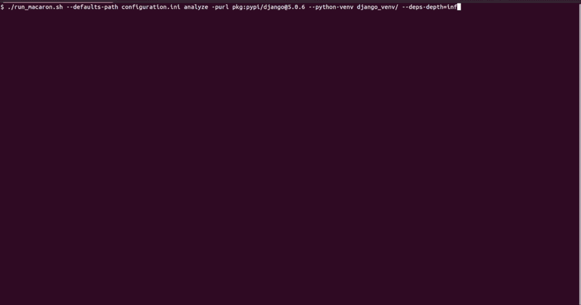

       

# Macaron

[Full Documentation](https://oracle.github.io/macaron/index.html) | [Tutorials](https://oracle.github.io/macaron/pages/tutorials/index.html) | [Videos](https://www.youtube.com/watch?v=ebo0kGKP6bw) | [Papers](#publications) | [Presentations](#presentations)

**Macaron** is a software supply chain security analysis tool from Oracle Labs focused on verifying the **build integrity** of artifacts and their dependencies. It helps developers, security teams, and researchers ensure that packages are built as expected and have not been tampered with.

## Key Capabilities

Macaron supports:
- **Attestation verification** for third-party and internal artifacts across major ecosystems like PyPI, npm, and Go, enabling automated provenance validation ([tutorial](https://oracle.github.io/macaron/pages/tutorials/provenance.html)).
- **Detection of malicious or suspicious packages** in popular ecosystems using customizable heuristics ([tutorial](https://oracle.github.io/macaron/pages/tutorials/detect_malicious_package.html), [blog post](https://blogs.oracle.com/developers/post/detecting-malicious-behavior-in-software-supply-chain-part-1)).
- **Detection of vulnerable GitHub Actions**, which is increasingly important due to recent real-world incidents like [tj-actions/changed-files](https://www.cve.org/CVERecord?id=CVE-2025-30066) ([tutorial](https://oracle.github.io/macaron/pages/tutorials/detect_vulnerable_github_actions.html)).
- **Reproducible build** through static analysis of build scripts. Macaron enables **rebuilding packages from source** and **comparing to released artifacts** to detect discrepancies, and therefore compromised workflows or artifacts ([paper](https://arxiv.org/pdf/2410.08427)).
- **Accurate repository and commit detection** for released artifacts, improving traceability and trust ([tutorial](https://oracle.github.io/macaron/pages/tutorials/source_finder.html)).

## Demo: Analyzing Django with Dependencies

This screencast shows how Macaron analyzes the `django@5.0.6` Python package and its dependencies. Macaron runs the same set of checks, including malware detection, on the dependencies as it does on the Django package. You can either generate a Software Bill of Materials (SBOM) manually or point Macaron to a virtual environment where Django is installed to automatically analyze the entire dependency tree. The policy engine ensures that the malware detection check passes for all packages in the dependency tree.

## Based on SLSA

Macaron follows the recommendations of the [SLSA (Supply chain Levels for Software Artifacts)](https://slsa.dev) framework. It offers a flexible, extensible policy engine for checking compliance with SLSA levels. Users can define and compose custom rules tailored to their CI/CD practices and security needs.

## Supported Build Tools

Macaron currently supports the following build tools:
- **Java**: Maven, Gradle  
- **Python**: pip, Poetry  
- **JavaScript**: npm, Yarn  
- **Go**
- **Docker**

## Adoption

Macaron is integrated into the [Graal Development Kit (GDK)](https://graal.cloud/gdk/), where it is used to generate **Verification Summary Attestations** for each artifact. This helps GDK users validate and trust the integrity of their dependencies ([tutorial](https://oracle.github.io/macaron/pages/tutorials/use_verification_summary_attestation.html), [blog post](https://blogs.oracle.com/java/post/announcing-graal-development-kit-for-micronaut-460)).

## Learn More

For a complete list of supported technologies, CI providers, and provenance formats, see the [documentation](https://oracle.github.io/macaron/pages/supported_technologies/index.html).

Macaron is actively evolving, with ongoing work to support more ecosystems and enhance supply chain security capabilities.

## Table of Contents

* [Getting started](#getting-started)
* [Contributing](#contributing)
* [Defining new checks](#defining-new-checks)
* [Publications](#publications)
* [Security](#security)
* [License](#license)

## Getting started

* To learn how to download and run Macaron, see our documentation [here](https://oracle.github.io/macaron/).
* Check out our [tutorials](https://oracle.github.io/macaron/pages/tutorials/index.html) to see how Macaron can detect software supply chain issues.
* You can also watch [this demo](https://www.youtube.com/watch?v=ebo0kGKP6bw) to learn more about Macaron.

## Contributing

This project welcomes contributions from the community. Before submitting a pull request, please [review our contribution guide](./CONTRIBUTING.md).

## Defining new checks

After cloning a repository, Macaron parses the CI configuration files and bash scripts that are triggered by the CI, creates call graphs and other intermediate representations as abstractions. Using such abstractions, Macaron implements concrete checks to gather facts and metadata based on a security specification.

To learn how to define your own checks, see the steps in the [checks documentation](/src/macaron/slsa_analyzer/checks/README.md).

## Presentations

* [Securing the Software Supply Chain with Macaron: A Comprehensive Tool for Analysis and Protection](https://labs.oracle.com/pls/apex/f?p=94065:10:15059068980668:11351), Supply Chain Security Summit 2025.

* [Towards safeguarding software components from supply chain attacks](https://labs.oracle.com/pls/apex/f?p=94065:10:117744701900:10830), Chalmers Security & Privacy Lab Seminars 2024.

## Publications

* Behnaz Hassanshahi, Trong Nhan Mai, Alistair Michael, Benjamin Selwyn-Smith, Sophie Bates, and Padmanabhan Krishnan: [Macaron: A Logic-based Framework for Software Supply Chain Security Assurance](https://dl.acm.org/doi/abs/10.1145/3605770.3625213), SCORED 2023. Best paper award :trophy:

* Behnaz Hassanshahi, Trong Nhan Mai, Benjamin Selwyn-Smith, and Nicholas Allen: [Unlocking Reproducibility: Automating re-Build Process for Open-Source Software](https://arxiv.org/pdf/2509.08204), ASE Industry Showcase 2025.

* Ridwan Shariffdeen, Behnaz Hassanshahi, Martin Mirchev, Ali El Husseini, Abhik Roychoudhury [Detecting Python Malware in the Software Supply Chain with Program Analysis](https://labs.oracle.com/pls/apex/f?p=94065:10:11591088449483:11569), ICSE-SEIP 2025.

* Jens Dietrich, Tim White, Behnaz Hassanshahi, Paddy Krishnan [Levels of Binary Equivalence for the Comparison of Binaries
from Alternative Builds](https://arxiv.org/pdf/2410.08427), ICSME Industry Track 2025.

* Jens Dietrich, Tim White, Valerio Terragni, Behnaz Hassanshahi [Towards Cross-Build Differential Testing](https://labs.oracle.com/pls/apex/f?p=94065:10:11591088449483:11549), ICST 2025.

* Jens Dietrich, Tim White, Mohammad Mahdi Abdollahpour, Elliott Wen, Behnaz Hassanshahi [BinEq-A Benchmark of Compiled Java Programs to Assess Alternative Builds](https://dl.acm.org/doi/10.1145/3689944.3696162), SCORED 2024.

* Jens Dietrich and Behnaz Hassanshahi [DALEQ--Explainable Equivalence for Java Bytecode](https://arxiv.org/pdf/2508.01530), ASE Industry Showcase 2025.

## Security

Please consult the [security guide](./SECURITY.md) for our responsible security vulnerability disclosure process.

## License

Copyright (c) 2022, 2024 Oracle and/or its affiliates.
Macaron is licensed under the [Universal Permissive License (UPL), Version 1.0](./LICENSE.txt).
