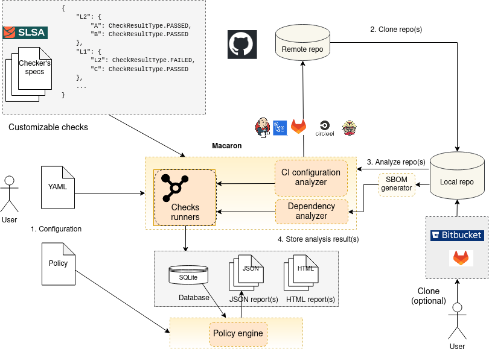

.. Copyright (c) 2022 - 2023, Oracle and/or its affiliates. All rights reserved.
.. Licensed under the Universal Permissive License v 1.0 as shown at https://oss.oracle.com/licenses/upl/.

.. _index:

.. meta::
   :description: macaron - A CI/CD security analysis tool for supply-chain attacks
   :keywords: CI/CD, SLSA, supply-chain security

=====================
Macaron documentation
=====================

Software supply-chain attacks are becoming more prevalent as the systems get more complex, particularly with respect to the use of open-source
third-party code. Attacks include stealing credentials, tampering with the
code, tampering with the code repository, and tampering with the build system.
It is crucial to have guarantees that the third-party code we rely on is the
code we expect.

To tackle these problems, `Supply-chain Levels for Software Artifacts (SLSA or "salsa") <https://slsa.dev>`_ is created to improve the integrity and
protection of the software supply-chain. Macaron can analyze a software
repository to determine its SLSA level and provide supply-chain transparency of the build process.

--------
Overview
--------

Macaron is an analysis tool which focuses on the build process for an artifact and its dependencies. As the SLSA requirements
are at a high-level, Macaron first defines these requirements as specific
concrete rules that can be checked automatically. Macaron has a customizable checker platform that makes it easy to define checks that depend on each other.

---------------
Getting started
---------------

To start with Macaron, see the :doc:`Installation </pages/installation>` and :doc:`Using </pages/using>` pages.

For all services and technologies that Macaron supports, see the :doc:`Supported Technologies </pages/supported_technologies/index>` page.

.. _checks:

-------------------------
Current checks in Macaron
-------------------------

The table below shows the current set of actionable checks derived from
the requirements that are currently supported by Macaron.

.. note:: The current checks are designed based on `SLSA v0.1 <https://slsa.dev/spec/v0.1/>`_. Support for `SLSA v1.0 <https://slsa.dev/spec/v1.0/>`_ is currently under development.

.. list-table:: Mapping SLSA requirements to Macaron checks
   :widths: 20 40 40
   :header-rows: 1

   * - SLSA level
     - SLSA spec v0.1
     - Concrete check
   * - 1
     - **Scripted build** - All build steps were fully defined in a “build script”.
     - Identify and validate build script(s).
   * - 1
     - **Provenance available** - Provenances are available.
     - Check for existence of provenances, which can be :term:`SLSA` or :term:`Witness` provenances. If there is no provenance, the repo can still be compliant to level 1 given the build script is available.
   * - 1
     - **Witness provenance** - One or more :term:`Witness` provenances are discovered.
     - Check for existence of :term:`Witness` provenances, and whether artifact digests match those in the provenances.
   * - 2
     - **Build service** - All build steps are run using some build service (e.g. GitHub Actions)
     - Identify and validate the CI service(s) used for the build process.
   * - 3
     - **Trusted builders** - Guarantees the identification of the top-level build configuration used to initiate the build. The build is verified to be hermetic, isolated, parameterless, and executed in an ephemeral environment.
     - Identify and validate that the builder used in the CI pipeline is a trusted one.
   * - 3
     - **Build as code** - If a trusted builder is not present, this requirement determines that the build definition and configuration executed by the build service is verifiably derived from text file definitions stored in a version control system.
     - Identify and validate the CI service(s) used to build and deploy/publish an artifact.
   * - 3
     - **Infer artifact publish pipeline** - When a provenance is not available, checks whether a CI workflow run has automatically published the artifact.
     - Identify a workflow run that has triggered the deploy step determined by the ``Build as code`` check.
   * - 3
     - **Provenance Level three** - Check whether the target has SLSA provenance level 3.
     - Use the `slsa-verifier <https://github.com/slsa-framework/slsa-verifier>`_ to attest to the subjects in the SLSA provenance that accompanies an artifact.
   * - 3
     - **Provenance expectation** - Check if the provenance meets an expectation.
     - The user can provide an expectation for the provenance as a CUE policy, which will be compared against the SLSA provenance.

----------------------
How does Macaron work?
----------------------

.. _fig_macaron:

   Macaron's infrastructure

Macaron is designed based on a Zero Trust model. It analyzes a target repository as an external
tool and requires minimal configurations. After cloning a repository, Macaron parses the CI
configuration files and bash scripts that are triggered by the CI, creates call graphs and other
intermediate representations as abstractions. Using such abstractions, Macaron implements concrete checks based on a security specification and verifies the desired properties.

.. toctree::
   :maxdepth: 2

   pages/installation
   pages/using
   pages/cli_usage/index
   pages/tutorials/index
   pages/output_files
   pages/vsa
   pages/supported_technologies/index
   pages/developers_guide/index
   glossary
