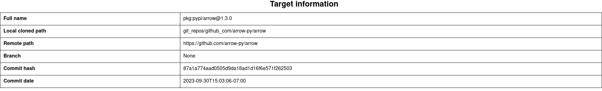
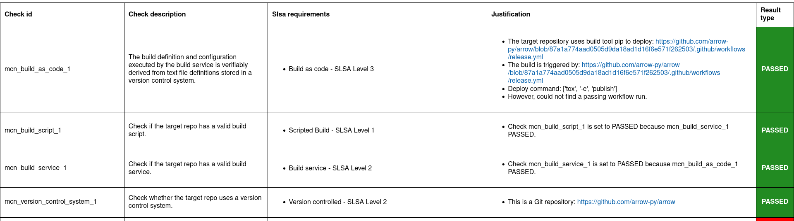
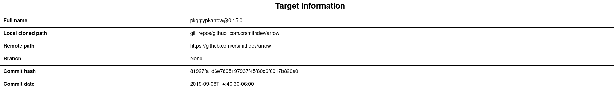
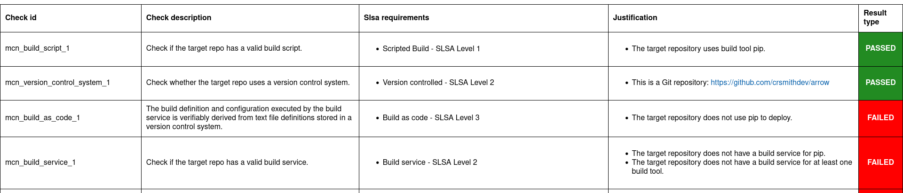

.. Copyright (c) 2024 - 2024, Oracle and/or its affiliates. All rights reserved.
.. Licensed under the Universal Permissive License v 1.0 as shown at https://oss.oracle.com/licenses/upl/.

---------------------------------------------------------
Analyzing and comparing different versions of an artifact
---------------------------------------------------------

This tutorial demonstrates how Macaron can be used to determine the differences between one or more states of the single open-source repository that produced one or more related artifacts. In this way, we show how a developer can be potentially misled by supply chain security information that has been created for the current state of an artifact's source repository, rather than the version of the artifact they are actually using.

It is challenging to map artifacts to the source code because most artifacts, even open-source ones, do not provide a direct URL to the related repository and commit:

    * For finding repositories, services exist to make up for this lack, including Google's `Open Source Insights <https://deps.dev>`_ tool that is in use by Macaron itself for this exact reason. However, without the commit as well, analysis of these repositories will reflect only the current state at the time of execution. One example of this is `OpenSSF Scorecard <https://github.com/ossf/scorecard>`_, an automated tool that performs a number of software security checks on a given project. These projects are typically provided in the form of a repository's public URL, which will be examined at its current state.

    * For finding commits, we can look inside the provenances for an artifact, such as :term:`SLSA` or :term:`Witness`, as these contain a record of the commit used to build that artifact. However, the current adoption rate in the open-source community is low, therefore we need alternative solutions.

Macaron's solution to this challenge is the Commit Finder feature. This feature performs a best effort attempt to map a given artifact to the exact commit that was used to create it so that the correct state for a given artifact can be analyzed. Commits are discovered by matching artifact versions to tags within repositories, necessitating a requirement that any repository to be analyzed makes use of tags in a way that closely corresponds to the produced artifact's version numbers.

For this tutorial, we analyze the Python library, `Arrow <https://github.com/arrow-py/arrow>`_. Arrow is a popular library designed to improve the developer experience for manipulating dates and times.

******************************
Installation and Prerequisites
******************************

Skip this section if you already know how to install Macaron.

.. toggle::

    Please follow the instructions :ref:`here <installation-guide>`. In summary, you need:

        * Docker
        * the ``run_macaron.sh``  script to run the Macaron image.

    .. note:: At the moment, Docker alternatives (e.g. podman) are not supported.

    You also need to provide Macaron with a GitHub token through the ``GITHUB_TOKEN``  environment variable.

    To obtain a GitHub Token:

    * Go to ``GitHub settings`` → ``Developer Settings`` (at the bottom of the left side pane) → ``Personal Access Tokens`` → ``Fine-grained personal access tokens`` → ``Generate new token``. Give your token a name and an expiry period.
    * Under ``"Repository access"``, choosing ``"Public Repositories (read-only)"`` should be good enough in most cases.

    Now you should be good to run Macaron. For more details, see the documentation :ref:`here <prepare-github-token>`.

********
Analysis
********

To perform an analysis on Arrow, Macaron can be run with the following command:

.. code-block:: shell

    ./run_macaron.sh analyze -rp https://github.com/arrow-py/arrow --skip-deps

However, this will return results based only on the current state of the repository, which as described above, is not what we want to achieve in this tutorial. To perform analyses on other repository states, we need to provide Macaron with the target artifact versions in the form of `PURLs <https://github.com/package-url/purl-spec>`_, or Package URLs, which is a convenient way to encode packages from different ecosystems into the same format.

In our case we are looking at a Python package, so our PURL must reflect that. For versions we will analyze ``1.3.0`` and ``0.15.0``, giving us the following PURLs:

.. code-block:: shell

    pkg:pypi/arrow@1.3.0
    pkg:pypi/arrow@0.15.0

.. note:: Macaron also accepts a branch and digest alongside a repository URL for analyzing a specific state. By using a PURL we let Macaron determine these details itself, saving us the trouble of looking them up.

We will start by running the analysis on the latest version, ``1.3.0``, with the following command:

.. code-block:: shell

    ./run_macaron.sh analyze -purl pkg:pypi/arrow@1.3.0 --skip-deps

The analysis involves Macaron downloading the contents of the target repository to the configured, or default, ``output`` folder. Results from the analysis, including checks, are stored in the database found at ``output/macaron.db``  (See :ref:`Output Files Guide <output_files_guide>`). Once the analysis is complete, Macaron will also produce a report in the form of a HTML file.

.. code-block:: shell

  open output/reports/pypi/arrow/arrow.html

.. note:: When analyzing multiple versions of the same software component, keep in mind that Macaron will override the output HTML and JSON reports in subsequent runs, but still keep results for each version in the database.

.. _fig_arrow_1.3.0_top:

.. _fig_arrow_1.3.0:

This image shows the results of the checks for the `Arrow <https://github.com/arrow-py/arrow>`_ repository at the commit where version ``1.3.0`` was produced.
In summary, our analysis finds that the artifact has:

* A commit in a Git repository that corresponds to the artifact (``mcn_version_control_system_1``)
* Build scripts for the build tool ``pip`` (``mcn_build_script_1``)
* GitHub Actions workflow to build the package (``mcn_build_service_1``)
* GitHub Actions workflow to deploy and publish the package (``mcn_build_as_code_1``)

Now we should run the next analysis, and then open the new report.

.. code-block:: shell

    ./run_macaron.sh analyze -purl pkg:pypi/arrow@0.15.0 --skip-deps
    open output/reports/pypi/arrow/arrow.html

.. _fig_arrow_0.15.0_top:

.. _fig_arrow_0.15.0:

In the second report for Arrow, we can see that Macaron has returned different results. Starting with the ``Target Information`` section we can see that the repository for this older artifact is not the same as the current one: ``https://github.com/crsmithdev/arrow`` instead of ``https://github.com/arrow-py/arrow``. In the checks section, we can see that two of the four checks that passed for the previous version, did not pass for this earlier version. Checks ``mcn_build_service_1`` and ``mcn_build_as_code_1`` failed, indicating that the older artifact did not have a GitHub Actions workflow setup to build or publish the package. In this way Macaron has demonstrated the usefulness of being able to analyze a repository at multiple stages, thereby allowing for a more accurate analysis when investigating artifacts that are, or use, outdated libraries.

*****************************
Run ``verify-policy`` command
*****************************

Another feature of Macaron is policy verification. This allows Macaron to report on whether an artifact meets the security requirements specified by the user. Policies are written using `Soufflé Datalog <https://souffle-lang.github.io/index.html>`_ , a language similar to SQL. Results collected by the ``analyze`` command can be checked via declarative queries in the created policy, which Macaron can then automatically check.

The security requirement chosen for this tutorial reflects the difference between the two versions in the previous section. That is, we want to ensure that the artifact has a valid hosted build platform for building and publishing. If we refer back to :ref:`Arrow 0.15.0 <fig_arrow_0.15.0>` and :ref:`Arrow 1.3.0 <fig_arrow_1.3.0>`, we can use the check ID ``mcn_build_as_code_1`` to identify the differences between the two versions. Note that in Macaron the result of one check can depend on the result of another check. This is especially useful to avoid running checks if unnecessary. In this example, if the ``mcn_build_as_code_1`` check passes, it is implied that ``mcn_build_service_1`` is passed too because while the former checks that the CI service (GitHub Actions) is set up to automatically build and publish to a registry, the latter checks if a build step exists in the CI even if it is used for testing purposes only. Since we are interested to know if the Arrow artifact is published automatically from a hosted build platform, we just include the ``mcn_build_as_code_1`` check in the policy as follows:

.. code-block:: c++

    #include "prelude.dl"

    Policy("has-hosted-build", component_id, "Require a hosted build and publishing service.") :-
        check_passed(component_id, "mcn_build_as_code_1").

    apply_policy_to("has-hosted-build", component_id) :-
        is_component(component_id, purl),
        match("pkg:pypi/arrow.*", purl).

The second part of the above policy, ``apply_policy_to``, applies the policy to software components found within Macaron's local database created and populated in the previous steps. In this policy, any software component whose PURL begins with ``pkg:pypi/arrow`` will be verified by the policy, thanks to Soufflé's `match constraint <https://souffle-lang.github.io/constraints>`_ that can be used for string matching. This will capture both versions of the Arrow library used in the previous section. To use the completed policy, we save it to an easily accessible location, such as the directory Macaron is in, with a name such as ``has-hosted-build.dl``. With the policy file created and saved, we can run Macaron's policy engine as follows:

.. code-block:: shell

  ./run_macaron.sh verify-policy --database ./output/macaron.db --file ./has-hosted-build.dl

At the end of the output of this command, Macaron will display the following:

.. code-block:: javascript

    passed_policies
    component_satisfies_policy
        ['1', 'pkg:pypi/arrow@1.3.0', 'has-hosted-build']
    failed_policies
        ['has-hosted-build']
    component_violates_policy
        ['2', 'pkg:pypi/arrow@0.15.0', 'has-hosted-build']

This confirms the findings of the previous section, showing that the earlier version of the Arrow library does not meet our expectations in that it is lacking a discoverable build service, while the more recent version is just fine and passes.

***********
Future Work
***********

Mapping artifact to commits within repositories is a challenging endeavour. Macron's Commit Finder feature relies on repositories having and using version tags in a sensible way (a tag is considered sensible if it closely matches the version it represents). An alternative, or complimentary, approach would be to make use of the information found within provenance files, where information such as the commit hash used to create the artifact can potentially be found. Additionally, it should be noted that the Commit Finder feature was modelled on the intentions of developers (in terms of tag usage) within a large quantity of Java projects. As tag formatting is "generally" language agnostic in the same way that versioning schemes are, this feature should work well for other languages. However, there may be some improvements to be made by further testing on a large number of non-Java projects.
