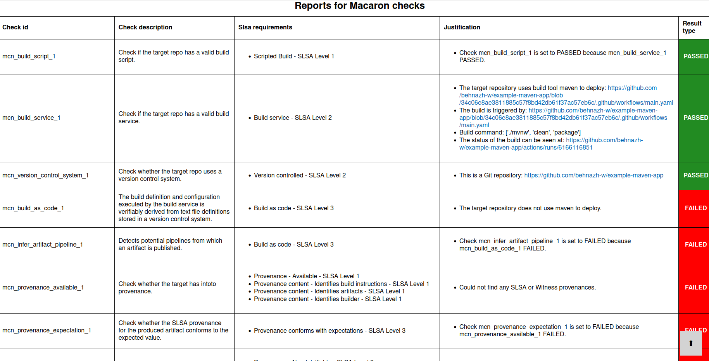
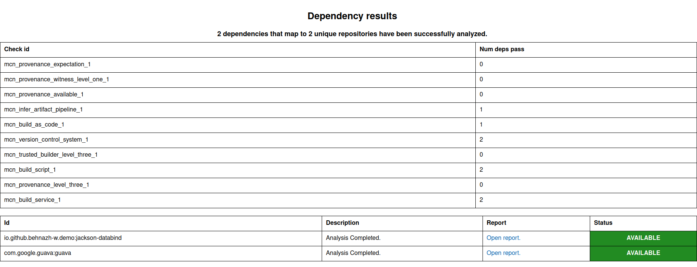
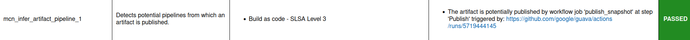

.. Copyright (c) 2024 - 2024, Oracle and/or its affiliates. All rights reserved.
.. Licensed under the Universal Permissive License v 1.0 as shown at https://oss.oracle.com/licenses/upl/.

------------------------------------------------------------------------
Detecting a malicious Java dependency uploaded manually to Maven Central
------------------------------------------------------------------------

In this tutorial we show how Macaron can determine whether the dependencies of a Java project are built
and published via transparent CI workflows or manually uploaded to Maven Central. You can also
`watch <https://www.youtube.com/watch?v=ebo0kGKP6bw>`_ the demo of this tutorial.

When an artifact is manually uploaded, the artifact distributor can modify the artifact and potentially
include malicious code without being detected. The example project we analyze in this tutorial is
`example-maven-app <https://github.com/behnazh-w/example-maven-app>`_,
which is hosted on GitHub. This example application uses Maven to build and manage dependencies, and has two
dependencies:

.. list-table::
   :widths: 25 50
   :header-rows: 1

   * - Artifact name
     - `Package URL (PURL) <https://github.com/package-url/purl-spec>`_
   * - `guava <https://central.sonatype.com/artifact/com.google.guava/guava>`_
     - ``pkg:maven/com.google.guava/guava@32.1.2-jre?type=jar``
   * - `jackson-databind <https://central.sonatype.com/artifact/io.github.behnazh-w.demo/jackson-databind>`_
     - ``pkg:maven/io.github.behnazh-w.demo/jackson-databind@1.0?type=jar``

While the ``guava`` dependency follows best practices to publish artifacts automatically with minimal human
intervention, ``jackson-databind`` is a malicious dependency that pretends to provide data-binding functionalities
like `the official jackson-databind <https://github.com/FasterXML/jackson-databind>`_ library (note that
this artifact is created for demonstration purposes and is not actually malicious).

Now let's see how Macaron can help us with evaluating the supply chain security posture of
``example-maven-app`` and its dependencies.

******************************
Installation and Prerequisites
******************************

Skip this section if you already know how to install Macaron.

.. toggle::

    Please follow the instructions :ref:`here <installation-guide>`. In summary, you need:

        * Docker
        * the ``run_macaron.sh``  script to run the Macaron image.

    .. note:: At the moment, Docker alternatives (e.g. podman) are not supported.

    You also need to provide Macaron with a GitHub token through the ``GITHUB_TOKEN``  environment variable.

    To obtain a GitHub Token:

    * Go to ``GitHub settings`` → ``Developer Settings`` (at the bottom of the left side pane) → ``Personal Access Tokens`` → ``Fine-grained personal access tokens`` → ``Generate new token``. Give your token a name and an expiry period.
    * Under ``"Repository access"``, choosing ``"Public Repositories (read-only)"`` should be good enough in most cases.

    Now you should be good to run Macaron. For more details, see the documentation :ref:`here <prepare-github-token>`.

***********************
Run ``analyze`` command
***********************

First, we need to run the ``analyze`` command of Macaron to run a number of :ref:`checks <checks>` and collect evidence for  ``example-maven-app`` and its dependencies.

.. code-block:: shell

  ./run_macaron.sh analyze -rp https://github.com/behnazh-w/example-maven-app

.. note:: By default, Macaron clones the repositories and creates output files under the ``output`` directory. To understand the structure of this directory please see :ref:`Output Files Guide <output_files_guide>`.

By default, this command analyzes the latest commit of the default branch of the repository. You can also analyze the repository
at a specific commit by providing the branch and commit digest. See the :ref:`CLI options<analyze-command-cli>` of the ``analyze`` command for more information.
After running the ``analyze`` command, we can view the data that Macaron has gathered about the ``example-maven-app`` repository in an HTML report.

.. code-block:: shell

  open output/reports/github_com/behnazh-w/example-maven-app/example-maven-app.html

.. _fig_example-maven-app:

|

The image above shows the results of the checks for `example-maven-app <https://github.com/behnazh-w/example-maven-app>`_ repository itself.
As you can see, some of the checks are passing and some are failing. In summary, this project:

* is not producing any :term:`SLSA` or :term:`Witness` provenances (``mcn_provenance_available_1``)
* is using GitHub Actions to build and test using ``mvnw`` (``mcn_build_service_1``)
* but it is not deploying any artifacts automatically (``mcn_build_as_code_1``)
* and no CI workflow runs are detected that automatically publish artifacts (``mcn_infer_artifact_pipeline_1``)

As you scroll down in the HTML report, you will see a section for the dependencies that were automatically identified:

.. _fig_example-maven-app-deps:

|
| Macaron has found the two dependencies as expected:

* ``io.github.behnazh-w.demo:jackson-databind:1.0``
* ``com.google.guava:guava:32.1.2-jre``

When we open the reports for each dependency, we see that ``mcn_infer_artifact_pipeline_1`` is passed for ``com.google.guava:guava:32.1.2-jre``
and a GitHub Actions workflow run is found for publishing version ``32.1.2-jre``. However, this check is failing for ``io.github.behnazh-w.demo:jackson-databind:1.0``.
This means that ``io.github.behnazh-w.demo:jackson-databind:1.0`` could have been built and published manually to Maven Central
and could potentially be malicious.

.. _fig_infer_artifact_pipeline_guava:

   ``com.google.guava:guava:32.1.2-jre``

.. _fig_infer_artifact_pipeline_bh_jackson_databind:

.. figure:: ../../_static/images/tutorial_bh_jackson_databind_infer_pipeline.png
   :alt: mcn_infer_artifact_pipeline_1 for io.github.behnazh-w.demo:jackson-databind:1.0
   :align: center

   ``io.github.behnazh-w.demo:jackson-databind:1.0``

|

After running the ``analyze`` command, all the check results are stored in ``output/macaron.db``.
Next, we show how to use the policy engine to detect if the dependencies of ``example-maven-app``
are not published from a publicly available CI workflow run.

*****************************
Run ``verify-policy`` command
*****************************

While the ``analyze`` command shown in the previous section collects information,
it does not automatically confirm whether a repository satisfies **your** security requirements.
This is where the ``verify-policy``  command comes in. With Macaron, you can use `Soufflé Datalog <https://souffle-lang.github.io/index.html>`_
in order to express the security requirements and let Macaron automatically validate it against the collected data.
Datalog is very similar to SQL and allows writing declarative queries for the
results collected by the ``analyze`` command. We use such queries as policy rules as described next.

The security requirement in this tutorial is to mandate dependencies of our project to have a
transparent artifact publish CI workflows. To write a policy for this requirement, first we need to
revisit the checks shown in the HTML report in the previous :ref:`step <fig_example-maven-app>`.
The result of each of the checks can be queried by the check ID in the first column. For the policy in this tutorial,
we are interested in the ``mcn_infer_artifact_pipeline_1`` and ``mcn_provenance_level_three_1`` checks:

.. code-block:: c++

  #include "prelude.dl"

  Policy("detect-malicious-upload", component_id, "") :-
      is_component(component_id, _),
      !violating_dependencies(component_id).

  .decl violating_dependencies(parent: number)
  violating_dependencies(parent) :-
      transitive_dependency(parent, dependency),
      !check_passed(dependency, "mcn_infer_artifact_pipeline_1"),
      !check_passed(dependency, "mcn_provenance_level_three_1").

  apply_policy_to("detect-malicious-upload", component_id) :-
      is_repo(_, "github.com/behnazh-w/example-maven-app", component_id).

This policy requires that all the dependencies
of repository ``github.com/behnazh-w/example-maven-app`` either pass the ``mcn_provenance_level_three_1`` (have non-forgeable
:term:`SLSA` provenances) or ``mcn_infer_artifact_pipeline_1`` check. Note that if an artifact already has a non-forgeable provenance, it means it is produced
by a hosted build platform, such as GitHub Actions CI workflows. So, the ``mcn_infer_artifact_pipeline_1`` needs to pass
only if ``mcn_provenance_level_three_1`` fails.

Let's take a closer look at this policy to understand what each line means.

.. code-block:: c++

  #include "prelude.dl"

This line imports the predefined Datalog relations into your Datalog specification. These relations
can be thought of as select statements specifically provided by Macaron to make it easier for you
to write policies. In our example policy, the following relations are pre-defined:

* ``Policy(policy_id: symbol, target_id: number, message: symbol)``
* ``is_component(component_id: number, purl: symbol)``
* ``transitive_dependency(parent: number, dependency: number)``
* ``check_passed(component_id: number, check_name: symbol)``
* ``apply_policy_to(policy_id: symbol, component_id: number)``
* ``is_repo(repo_id: number, repo_complete_name: symbol, component_id: number)``

And the following relation is declared in this policy:

* ``violating_dependencies(parent: number)``

Feel free to browse through the available
relations `here <https://github.com/oracle/macaron/blob/main/src/macaron/policy_engine/prelude/>`_
to see how they are constructed before moving on.

.. code-block:: c++

  Policy("detect-malicious-upload", component_id, "") :-
    is_component(component_id, _),
    !violating_dependencies(component_id).

This rule populates the ``Policy`` relation if ``component_id`` exists in the database and
``violating_dependencies`` relation for this component is empty.

.. code-block:: c++

  .decl violating_dependencies(parent: number)
  violating_dependencies(parent) :-
      transitive_dependency(parent, dependency),
      !check_passed(dependency, "mcn_infer_artifact_pipeline_1"),
      !check_passed(dependency, "mcn_provenance_level_three_1").

This is the rule that the user needs to design to detect dependencies that violate a security requirement.
Here we declare a relation called ``violating_dependencies`` and populate it if the dependencies in the
``transitive_dependency`` relation do not pass any of the ``mcn_infer_artifact_pipeline_1`` and
``mcn_provenance_level_three_1`` checks.

.. code-block:: c++

    apply_policy_to("detect-malicious-upload", component_id) :-
      is_repo(_, "github.com/behnazh-w/example-maven-app", component_id).

Finally, the ``apply_policy_to`` rule applies the policy ``detect-malicious-upload`` on the
repository ``github.com/behnazh-w/example-maven-app``. Note that each run of Macaron analyzes a repository at a specific
commit. So, the database can include more than one result for a repository and this policy will be
validated on all commits available in the database.

Let's name this policy ``example-maven-app.dl``. To verify this policy run:

.. code-block:: shell

  ./run_macaron.sh verify-policy --database ./output/macaron.db --file ./example-maven-app.dl

You can see the policy result both in the console and ``output/policy_report.json``. The results
printed to the console will look like the following:

.. code-block:: javascript

  passed_policies
  component_satisfies_policy
  failed_policies
      ['detect-malicious-upload']
  component_violates_policy
      ['1', 'pkg:github.com/behnazh-w/example-maven-app@34c06e8ae3811885c57f8bd42db61f37ac57eb6c', 'detect-malicious-upload']

As you can see, the policy has failed because the ``io.github.behnazh-w.demo:jackson-databind:1.0``
dependency is manually uploaded to Maven Central and does not meet the security requirement.

You can use this policy in your GitHub Actions to prevent a deployment or fail a CI test during the
development. Alternatively, you can treat the result as a warning and manually investigate the
dependencies to make sure they are secure and can be trusted.
