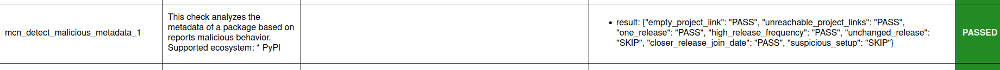

.. Copyright (c) 2024 - 2024, Oracle and/or its affiliates. All rights reserved.
.. Licensed under the Universal Permissive License v 1.0 as shown at https://oss.oracle.com/licenses/upl/.

.. _detect-malicious-package:

----------------------------
Detecting malicious packages
----------------------------

In this tutorial we show how to use Macaron to find malicious packages. Imagine you’ve discovered a Python package you want to add as a dependency to your project, but you’re unsure whether you can trust its maintainers. In this case, you can run Macaron to see if it can detect any malicious behavior. Note that Macaron is an analysis tool and can either miss a malicious behavior or report a false positive.

.. list-table::
   :widths: 25
   :header-rows: 1

   * - Supported packages for analysis
   * - Python packages (PyPI)

Note that known malware is reported for packages across all ecosystems.

.. contents:: :local:

**********
Background
**********

Detecting malicious behavior in open-source software has been a focus for the `Open Source Security Foundation <https://github.com/ossf>`_ (OpenSSF) community in recent years. One significant initiative is :term:`SLSA`, which offers practical recommendations to enhance the integrity of software packages and infrastructure. Macaron is designed to detect poorly maintained or malicious packages by implementing checks inspired by the SLSA specification. However, some forms of attacks currently fall outside the scope of SLSA version 1—notably, SLSA doesn't address the issue of malicious maintainers. Our primary goal is to make it more difficult for malicious actors to compromise critical supply chains and infrastructure. To achieve this, we're developing new methods to detect when maintainers of open source projects are untrustworthy and deliberately spreading malware.

******************************
Installation and Prerequisites
******************************

Skip this section if you already know how to install Macaron.

.. toggle::

    Please follow the instructions :ref:`here <installation-guide>`. In summary, you need:

        * Docker
        * the ``run_macaron.sh``  script to run the Macaron image.

    .. note:: At the moment, Docker alternatives (e.g. podman) are not supported.

    You also need to provide Macaron with a GitHub token through the ``GITHUB_TOKEN``  environment variable.

    To obtain a GitHub Token:

    * Go to ``GitHub settings`` → ``Developer Settings`` (at the bottom of the left side pane) → ``Personal Access Tokens`` → ``Fine-grained personal access tokens`` → ``Generate new token``. Give your token a name and an expiry period.
    * Under ``"Repository access"``, choosing ``"Public Repositories (read-only)"`` should be good enough in most cases.

    Now you should be good to run Macaron. For more details, see the documentation :ref:`here <prepare-github-token>`.

***********
Run Macaron
***********

In this tutorial, we run Macaron on the ``django`` Python package as an example with and without its dependencies to check malicious behavior and apply a policy to fail if the corresponding check fails.

'''''''''''''''''''''''''''''''''''''
Analyzing django without dependencies
'''''''''''''''''''''''''''''''''''''

First, we need to run the ``analyze`` command of Macaron to run a number of :ref:`checks <checks>` on the ``django`` package. In this tutorial, we are interested in the results of the ``mcn_detect_malicious_metadata_1`` check. Check :ref:`this tutorial <include_exclude_checks>` if you would like to exclude other checks.

.. code-block:: shell

  ./run_macaron.sh analyze -purl pkg:pypi/django@5.0.6

.. note:: By default, Macaron clones the repositories and creates output files under the ``output`` directory. To understand the structure of this directory please see :ref:`Output Files Guide <output_files_guide>`.

.. code-block:: shell

  open output/reports/pypi/django/django.html

.. _fig_django-malware-check:

The image above shows the result of the ``mcn_detect_malicious_metadata_1`` check for ``django@5.0.6``. The check has passed, which means this package is not malicious. If a package is malicious, this check fails. If the ecosystem is not supported, the check returns ``UNKNOWN``. You can also see the result of individual heuristics applied in this check under the ``Justification`` column.

Now we can write a policy to ensure that all versions of ``django`` pass the ``mcn_detect_malicious_metadata_1`` check. The policy will be enforced against the output of the ``analyze`` command that is cached in the local database at ``output/macaron.db``.

.. code-block:: shell

  ./run_macaron.sh verify-policy --database output/macaron.db --file policy.dl

Where the policy looks like below:

.. code-block:: prolog

  #include "prelude.dl"

  Policy("check-django", component_id, "Check django artifacts.") :-
      check_passed(component_id, "mcn_detect_malicious_metadata_1").

  apply_policy_to("check-django", component_id) :-
      is_component(component_id, purl),
      match("pkg:pypi/django@.*", purl).

The ``match`` constraint in this policy allows us to apply the policy on all versions of ``django``. The result of this command should show that the policy succeeds with a zero exit code (if a policy fails to pass, Macaron returns a none-zero error code):

.. code-block:: javascript

    passed_policies
        ['check-django']
    component_satisfies_policy
        ['1', 'pkg:pypi/django@5.0.6', 'check-django']
    failed_policies
    component_violates_policy

Note that the ``match`` constraint applies a regex pattern and can be expanded to ensure the ``mcn_detect_malicious_metadata_1`` check passes on all Python packages analyzed so far by Macaron:

.. code-block:: prolog

  apply_policy_to("check-django", component_id) :-
      is_component(component_id, purl),
      match("pkg:pypi.*", purl).

''''''''''''''''''''
Source Code Analysis
''''''''''''''''''''

.. note:: This is a new feature recently added to Macaron.

Macaron supports static code analysis as a malware analysis heuristic. This can be enabled by supplying the command line argument ``--analyze-source``. Macaron uses the open-source static code analysis tool Semgrep to analyse the source code of a python package, looking for malicious code patterns defined in Macaron's own Semgrep rules. Example detection patterns include identifying attempts to obfuscate source code and detecting code that exfiltrates sensitive data to remote connections.

By default, the source code analyzer is run in conjunction with the other metadata heuristics. The source code heuristic is optimised such that it is not always required to be run to ensure a package is benign, so it will not always be run as part of the heuristic analysis, even when enabled. To force it to run regardless of the result of other heuristics, the command line argument ``--force-analyze-source`` must be supplied. To analyze ``django@5.0.6`` with source code analysis enabled and enforced, the following command may be run:

.. code-block:: shell

  ./run_macaron.sh analyze -purl pkg:pypi/django@5.0.6 --python-venv "/tmp/.django_venv" --analyze-source --force-analyze-source

If any suspicious patterns are triggered, this will be identified in the ``mcn_detect_malicious_metadata_1`` result for the heuristic named ``suspicious_patterns``. The output database ``output/macaron.db`` can be used to get the specific results of the analysis by querying the :class:`detect_malicious_metadata_check.result field <macaron.database>`. This will provide detailed JSON information about all data collected by the ``mcn_detect_malicious_metadata_1`` check, including, for source code analysis, any malicious code patterns detected, what Semgrep rule detected it, the file in which it was detected, and the line number for the detection.

+++++++++++++++++++++++++++++++++++++++
Verification Summary Attestation report
+++++++++++++++++++++++++++++++++++++++

Additionally, Macaron generates a Verification Summary Attestation (:term:`VSA`) report that contains the policy, and information about the analyzed artifact. See :ref:`this page <vsa>` for more details. For instance, the VSA report for the ``check-django`` policy shown above can be viewed by running this command:

.. toggle::

  .. code-block:: shell

    cat output/vsa.intoto.jsonl | jq -r '.payload' | base64 -d | jq

  .. code-block:: json

    {
      "_type": "https://in-toto.io/Statement/v1",
      "subject": [
        {
          "uri": "pkg:pypi/django@5.0.6"
        }
      ],
      "predicateType": "https://slsa.dev/verification_summary/v1",
      "predicate": {
        "verifier": {
          "id": "https://github.com/oracle/macaron",
          "version": {
            "macaron": "0.11.0"
          }
        },
        "timeVerified": "2024-08-09T02:28:41.968492+00:00",
        "resourceUri": "pkg:pypi/django@5.0.6",
        "policy": {
          "content": "  #include \"prelude.dl\"\n\n  Policy(\"check-django\", component_id, \"Check django artifacts.\") :-\n check_passed(component_id, \"mcn_detect_malicious_metadata_1\").\n\n\n  apply_policy_to(\"check-django\", component_id) :-\n is_component(component_id, purl),\n match(\"pkg:pypi/django@.*\", purl)."
        },
        "verificationResult": "PASSED",
        "verifiedLevels": []
      }
    }

.. _django_with_deps:

''''''''''''''''''''''''''''''''''
Analyzing django with dependencies
''''''''''''''''''''''''''''''''''

Macaron supports analyzing a package's dependencies and performs the same set of checks on them as it does on the main target package. To analyze the dependencies of ``django@5.0.6`` Python package, you can either :ref:`generate an SBOM <python-sbom>` yourself or :ref:`point Macaron to a virtual environment <python-venv-deps>` where ``django`` is installed.

Let's assume ``/tmp/.django_venv`` is the virtual environment where ``django@5.0.6`` is installed.

.. note:: If you want Macaron to analyze the virtual environment directly to identify the dependencies, we require Python 3.11 to be used to install the package. Alternatively, you can generate the SBOM as instructed :ref:`here <python-sbom>` and pass it to Macaron as input.

Run Macaron as follows to analyze ``django`` and its direct dependencies.

.. code-block:: shell

  ./run_macaron.sh analyze -purl pkg:pypi/django@5.0.6 --python-venv "/tmp/.django_venv" --deps-depth=1

Or alternatively, run Macaron as follows to analyze ``django`` and all its transitive dependencies.

.. code-block:: shell

  ./run_macaron.sh analyze -purl pkg:pypi/django@5.0.6 --python-venv "/tmp/.django_venv" --deps-depth=inf

Now we can enforce the policy below to ensure that the ``mcn_detect_malicious_metadata_1`` check always passes on ``django`` and its dependencies, indicating that none of the dependencies have malicious behavior.

.. code-block:: prolog

  #include "prelude.dl"

  Policy("check-dependencies", component_id, "Check the dependencies of django.") :-
    transitive_dependency(component_id, dependency),
    check_passed(component_id, "mcn_detect_malicious_metadata_1"),
    check_passed(dependency, "mcn_detect_malicious_metadata_1").

  apply_policy_to("check-dependencies", component_id) :-
      is_component(component_id, purl),
      match("pkg:pypi/django@.*", purl).

As you can see below, the policy passes because Macaron doesn't detect malicious behavior for ``django`` or any of its transitive dependencies.

.. code-block:: javascript

  passed_policies
      ['check-dependencies']
  component_satisfies_policy
      ['1', 'pkg:pypi/django@5.0.6', 'check-dependencies']
  failed_policies
  component_violates_policy

''''''''''''''''''''''''''''''''''''''''
Require a confidence level in the policy
''''''''''''''''''''''''''''''''''''''''

Macaron also provides a confidence score for each check result, represented as a value ranging from ``0`` to ``1`` (inclusive). You can incorporate this score into your policy to ensure checks meet a required level of confidence. Currently, Macaron :class:`has these confidence levels <macaron.slsa_analyzer.checks.check_result.Confidence>`. For instance, you might adjust the :ref:`check-dependencies policy shown earlier <django_with_deps>` to require that the ``mcn_detect_malicious_metadata_1`` check passes with a high confidence, i.e., ``1``:

.. code-block:: prolog

  #include "prelude.dl"

  Policy("check-dependencies", component_id, "Check the dependencies of django with high confidence.") :-
      transitive_dependency(component_id, dependency),
      check_passed_with_confidence(component_id, "mcn_detect_malicious_metadata_1", confidence),
      check_passed_with_confidence(dependency, "mcn_detect_malicious_metadata_1", confidence),
      confidence = 1.

  apply_policy_to("check-dependencies", component_id) :-
      is_component(component_id, purl),
      match("pkg:pypi/django@.*", purl).

***********
Future Work
***********

We are actively working on the malware detection analysis check in Macaron — to improve precision, support more ecosystems, and in particular, perform more advanced source code analysis. Stay tuned and feel free to contribute to improve this check.
