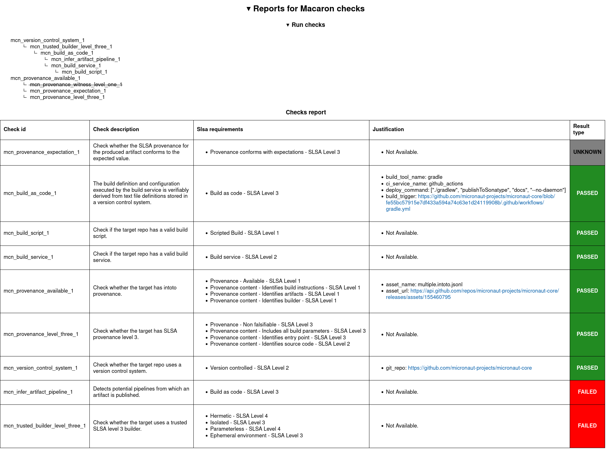

.. Copyright (c) 2024 - 2024, Oracle and/or its affiliates. All rights reserved.
.. Licensed under the Universal Permissive License v 1.0 as shown at https://oss.oracle.com/licenses/upl/.

.. _include_exclude_checks:

=====================================
Exclude and include checks in Macaron
=====================================

.. note::

    This feature is only available from Macaron 0.8.0

This tutorial will show how you can configure Macaron to:

* exclude checks that you don't want to run.
* include only checks that you want to run.

.. note::

    By default, Macaron will run all of its checks.

-------------
Prerequisites
-------------

* You are expected to have gone through :ref:`this tutorial <detect-manual-upload-java-dep>`.
* This tutorial requires a high-level understanding of checks in Macaron and how they depend on each other. Please see this :ref:`page <macaron-developer-guide>` for more information.

------------------
Motivating example
------------------

Let's say you want to run the analysis on Maven artifact ``io.micronaut/micronaut-core`` version ``4.3.10``.

Normally, this is how you would run Macaron:

.. code-block:: shell

  ./run_macaron.sh analyze --package-url pkg:maven/io.micronaut/micronaut-core@4.3.10

However, there can be checks in Macaron that are not relevant for the ``io.micronaut/micronaut-core`` artifact.
For example, the ``mcn_provenance_witness_level_one_1`` check (defined in :class:`ProvenanceWitnessL1Check <macaron.slsa_analyzer.checks.provenance_witness_l1_check.ProvenanceWitnessL1Check>`) is not relevant because ``micronaut-projects/micronaut-core`` generates and publishes :term:`SLSA` provenances and no :term:`Witness` provenances. Therefore, we could exclude this check from running by performing the following steps.

1. In your current directory, create a ``defaults.ini`` configuration file with the following content.

.. code-block:: ini

    [analysis.checks]
    exclude = mcn_provenance_witness_level_one_1
    include = *

In the ini configuration above:

* The ``exclude`` option contains the check ID ``mcn_provenance_witness_level_one_1``. The check with this ID will be excluded.
* The ``include`` option contains the `glob <https://docs.python.org/3/library/glob.html>`_ pattern ``*``. Checks with IDs matching this glob pattern will be included in the analysis. In this case, ``*`` matches all check IDs.

With these two configuration options, all checks except for the excluded ``mcn_provenance_witness_level_one_1`` will run.

2. Run Macaron analyze by providing the path to the custom ``defaults.ini`` configuration.

.. code-block:: shell

  ./run_macaron.sh --defaults-path ./defaults.ini analyze --package-url pkg:maven/io.micronaut/micronaut-core@4.3.10

This time, the check ``mcn_provenance_witness_level_one_1`` doesn't run. After the ``analyze`` command finishes, we can view the data that Macaron has gathered about the ``micronaut-projects/micronaut-core`` repository at ``v4.3.10`` in an HTML report. Note that the result of the excluded check is not recorded in the Macaron HTML reports, JSON reports, or the database).

.. code-block:: shell

  open output/reports/maven/io_micronaut/micronaut-core/micronaut-core.html

.. _fig_exclude_provenance_withness_level_one:

------------------------------------------------
Configuring exclude/include checks in ini config
------------------------------------------------

You can configure the exclusion and inclusion of checks through the ``[analysis.checks]`` section in the ``defaults.ini`` file. These are the defaults values:

.. code-block:: ini

    [analysis.checks]
    # By default, we don't exclude any checks.
    exclude =
    # By default, we run all checks available.
    include = *

The ``exclude`` and ``include`` options accept a list of strings (terminated by new lines). Each element in that list can either be:

* An ID of a check
* A glob pattern (similar to patterns used in `glob <https://docs.python.org/3/library/glob.html>`_). When a glob pattern is given, all check IDs that match it will be included in the corresponding ``exclude`` or ``include`` list.

The two lists of ``exclude`` and ``include`` check IDs obtained from your configuration can be defined as:

* ``EXPLICIT_EXCLUDE`` = checks excluded from the user configuration.
* ``EXPLICIT_INCLUDE`` = checks included from the user configuration.

Checks in Macaron depend on each other. Therefore, when you want to exclude/include a check, you must be aware of how that will affect its transitive children/parents:

* If a check is excluded, all of the children which can be transitively reached from it will be excluded.
* If a check is included, all of the parents which can be transitively reached from it will be included.

We define the list of check IDs after extending to transitive parents/children as:

* ``EFFECTIVE_INCLUDED`` = ``EXPLICIT_INCLUDE`` set plus transitive parents
* ``EFFECTIVE_EXCLUDED`` = ``EXPLICIT_EXCLUDE`` set plus transitive children

The final list of checks that will run can be defined as:

* ``FINAL_INCLUDED`` = ``EFFECTIVE_INCLUDED`` minus ``EFFECTIVE_EXCLUDED``

-------------
More examples
-------------

^^^^^^^^^^^^^^^^^^^^^
Not running any check
^^^^^^^^^^^^^^^^^^^^^
The following configurations will result in no check running and Macaron will return on error.

.. code-block:: ini

    [analysis.checks]
    exclude = *
    include = *

.. code-block:: ini

    [analysis.checks]
    exclude =
    include =

^^^^^^^^^^^^^^^^^^^^^^
Run a subset of checks
^^^^^^^^^^^^^^^^^^^^^^

.. code-block:: ini

    [analysis.checks]
    exclude =
    include =
        mcn_provenance_witness_level_one_1
        mcn_trusted_builder_level_three_1

This will result in ``mcn_provenance_witness_level_one_1``, ``mcn_trusted_builder_level_three_1``, and their transitive parents running.

^^^^^^^^^^^^^^^^^^^^^^^^^^
Disable a subset of checks
^^^^^^^^^^^^^^^^^^^^^^^^^^

.. code-block:: ini

    [analysis.checks]
    exclude =
        mcn_provenance_witness_level_one_1
        mcn_trusted_builder_level_three_1
    include = *

This will result in ``mcn_provenance_witness_level_one_1``, ``mcn_trusted_builder_level_three_1``, and their transitive children not running.

^^^^^^^^^^^^^^^^^^^^^^^^^^^^^^^^^^^^^^^^^^^^^^^^^^^^
Only run checks whose ID starts with ``mcn_build_*``
^^^^^^^^^^^^^^^^^^^^^^^^^^^^^^^^^^^^^^^^^^^^^^^^^^^^

.. code-block:: ini

    [analysis.checks]
    exclude =
    include =
        mcn_build_*
