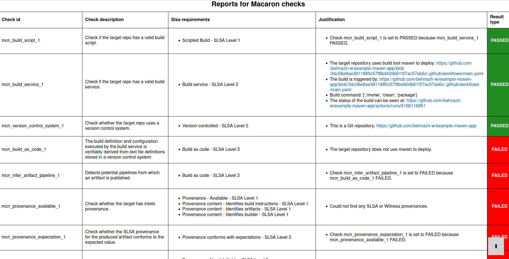
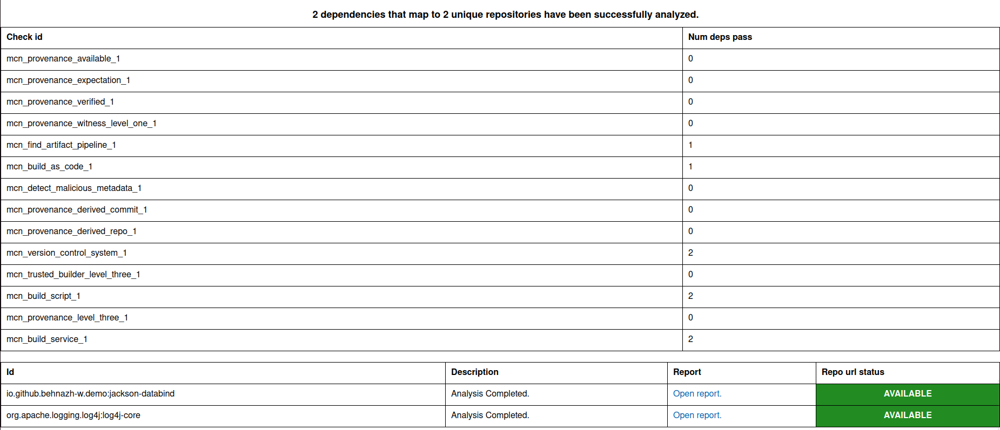
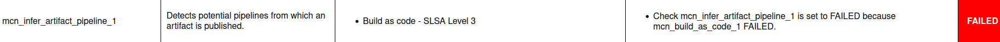
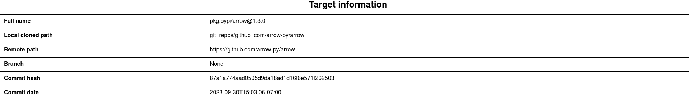

.. Copyright (c) 2023 - 2023, Oracle and/or its affiliates. All rights reserved.
.. Licensed under the Universal Permissive License v 1.0 as shown at https://oss.oracle.com/licenses/upl/.

.. References/links
.. _Witness: https://github.com/testifysec/witness
.. _SLSA: https://slsa.dev

.. _tutorials:

=========
Tutorials
=========

On this page, you will find tutorials to get you started with Macaron. The tutorials show Macaron
in action, analyzing a software component and its dependencies that are built using GitHub Actions
or GitLab. Macaron supports artifacts published on GitHub release, `Maven Central <https://central.sonatype.com>`_,
or privately hosted registries, such as `JFrog <https://jfrog.com/>`_.

---------------------------------------------------------------------
Detect a malicious Java dependency uploaded manually to Maven Central
---------------------------------------------------------------------

In this tutorial we show how Macaron can determine whether the dependencies of a Java project are built
and published via transparent CI workflows or manually uploaded to Maven Central. You can also
`watch <https://www.youtube.com/watch?v=ebo0kGKP6bw>`_ the demo of this tutorial.

When an artifact is manually uploaded, the artifact distributor can modify the artifact and potentially
include malicious code without being detected. The example project we analyze in this tutorial is
`example-maven-app <https://github.com/behnazh-w/example-maven-app>`_,
which is hosted on GitHub. This example application uses Maven to build and manage dependencies, and has two
dependencies:

.. list-table::
   :widths: 25 50
   :header-rows: 1

   * - Artifact name
     - `Package URL (PURL) <https://github.com/package-url/purl-spec>`_
   * - `guava <https://central.sonatype.com/artifact/com.google.guava/guava>`_
     - ``pkg:maven/com.google.guava/guava@32.1.2-jre?type=jar``
   * - `jackson-databind <https://central.sonatype.com/artifact/io.github.behnazh-w.demo/jackson-databind>`_
     - ``pkg:maven/io.github.behnazh-w.demo/jackson-databind@1.0?type=jar``

While the ``guava`` dependency follows best practices to publish artifacts automatically with minimal human
intervention, ``jackson-databind`` is a malicious dependency that pretends to provide data-binding functionalities
like `the official jackson-databind <https://github.com/FasterXML/jackson-databind>`_ library (note that
this artifact is created for demonstration purposes and is not actually malicious).

Now let's see how Macaron can help us with evaluating the supply chain security posture of
``example-maven-app`` and its dependencies.

************
Installation
************

Please follow the instructions :ref:`here <installation-guide>`. In summary, you need:

* Docker
* the ``run_macaron.sh``  script to run the Macaron image.

.. note:: At the moment, Docker alternatives (e.g. podman) are not supported.

*************
Prerequisites
*************

You need to provide Macaron with a GitHub token through the ``GITHUB_TOKEN``  environment variable.

To obtain a GitHub Token:

* Go to ``GitHub settings`` → ``Developer Settings`` (at the bottom of the left side pane) → ``Personal Access Tokens`` → ``Fine-grained personal access tokens`` → ``Generate new token``. Give your token a name and an expiry period.
* Under ``"Repository access"``, choosing ``"Public Repositories (read-only)"`` should be good enough in most cases.

Now you should be good to run Macaron. For more details, see the documentation :ref:`here <prepare-github-token>`.

***********************
Run ``analyze`` command
***********************

First, we need to run the ``analyze`` command of Macaron to run a number of :ref:`checks <checks>` and collect evidence for  ``example-maven-app`` and its dependencies.

.. code-block:: shell

  ./run_macaron.sh analyze -rp https://github.com/behnazh-w/example-maven-app

.. note:: By default, Macaron clones the repositories and creates output files under the ``output`` directory. To understand the structure of this directory please see :ref:`Output Files Guide <output_files_guide>`.

By default, this command analyzes the the latest commit of the default branch of the repository. You can also analyze the repository
at a specific commit by providing the branch and commit digest. See the :ref:`CLI options<analyze-command-cli>` of the ``analyze`` command for more information.
After running the ``analyze`` command, we can view the data that Macaron has gathered about the ``example-maven-app`` repository in an HTML report.

.. code-block:: shell

  open output/reports/github_com/behnazh-w/example-maven-app/example-maven-app.html

.. _fig_example-maven-app:

|

The image above shows the results of the checks for `example-maven-app <https://github.com/behnazh-w/example-maven-app>`_ repository itself.
As you can see, some of the checks are passing and some are failing. In summary, this project

* is not producing any `SLSA`_ or `Witness`_ provenances (``mcn_provenance_available_1``)
* is using GitHub Actions to build and test using ``mvnw`` (``mcn_build_service_1``)
* but it is not deploying any artifacts automatically (``mcn_build_as_code_1``)
* and no CI workflow runs are detected that automatically publish artifacts (``mcn_infer_artifact_pipeline_1``)

As you scroll down in the HTML report, you will see a section for the dependencies that were automatically identified:

.. _fig_example-maven-app-deps:

|
| Macaron has found the two dependencies as expected:

* ``io.github.behnazh-w.demo:jackson-databind:1.0``
* ``com.google.guava:guava:32.1.2-jre``

When we open the reports for each dependency, we see that ``mcn_infer_artifact_pipeline_1`` is passed for ``com.google.guava:guava:32.1.2-jre``
and a GitHub Actions workflow run is found for publishing version ``32.1.2-jre``. However, this check is failing for ``io.github.behnazh-w.demo:jackson-databind:1.0``.
This means that ``io.github.behnazh-w.demo:jackson-databind:1.0`` could have been built and published manually to Maven Central
and could potentially be malicious.

.. _fig_infer_artifact_pipeline_guava:

.. figure:: ../../_static/images/tutorial_guava_infer_pipeline.png
   :alt: mcn_infer_artifact_pipeline_1 for com.google.guava:guava:32.1.2-jre
   :align: center

   ``com.google.guava:guava:32.1.2-jre``

.. _fig_infer_artifact_pipeline_bh_jackson_databind:

   ``io.github.behnazh-w.demo:jackson-databind:1.0``

|

After running the ``analyze`` command, all the check results are stored in ``output/macaron.db``.
Next, we show how to use the policy engine to detect if the dependencies of ``example-maven-app``
are not published from a publicly available CI workflow run.

*****************************
Run ``verify-policy`` command
*****************************

While the ``analyze`` command shown in the previous section collects information,
it does not automatically confirm whether a repository satisfies **your** security requirements.
This is where the ``verify-policy``  command comes in. With Macaron, you can use `Soufflé Datalog <https://souffle-lang.github.io/index.html>`_
in order to express the security requirements and let Macaron automatically validate it against the collected data.
Datalog is very similar to SQL and allows writing declarative queries for the
results collected by the ``analyze`` command. We use such queries as policy rules as described next.

The security requirement in this tutorial is to mandate dependencies of our project to have a
transparent artifact publish CI workflows. To write a policy for this requirement, first we need to
revisit the checks shown in the HTML report in the previous :ref:`step <fig_example-maven-app>`.
The result of each of the checks can be queried by the check ID in the first column. For the policy in this tutorial,
we are interested in the ``mcn_infer_artifact_pipeline_1`` and ``mcn_provenance_level_three_1`` checks:

.. code-block:: c++

  #include "prelude.dl"

  Policy("detect-malicious-upload", component_id, "") :-
      is_component(component_id, _),
      !violating_dependencies(component_id).

  .decl violating_dependencies(parent: number)
  violating_dependencies(parent) :-
      transitive_dependency(parent, dependency),
      !check_passed(dependency, "mcn_infer_artifact_pipeline_1"),
      !check_passed(dependency, "mcn_provenance_level_three_1").

  apply_policy_to("detect-malicious-upload", component_id) :-
      is_repo(_, "github.com/behnazh-w/example-maven-app", component_id).

This policy requires that all the dependencies
of repository ``github.com/behnazh-w/example-maven-app`` either pass the ``mcn_provenance_level_three_1`` (have non-forgeable
`SLSA`_ provenances) or ``mcn_infer_artifact_pipeline_1`` check. Note that if an artifact already has a non-forgeable provenance, it means it is produced
by a hosted build platform, such as GitHub Actions CI workflows. So, the ``mcn_infer_artifact_pipeline_1`` needs to pass
only if ``mcn_provenance_level_three_1`` fails.

Let's take a closer look at this policy to understand what each line means.

.. code-block:: c++

  #include "prelude.dl"

This line imports the predefined Datalog relations into your Datalog specification. These relations
can be thought of as select statements specifically provided by Macaron to make it easier for you
to write policies. In our example policy, the following relations are pre-defined:

* ``Policy(policy_id: symbol, target_id: number, message: symbol)``
* ``is_component(component_id: number, purl: symbol)``
* ``transitive_dependency(parent: number, dependency: number)``
* ``check_passed(component_id: number, check_name: symbol)``
* ``apply_policy_to(policy_id: symbol, component_id: number)``
* ``is_repo(repo_id: number, repo_complete_name: symbol, component_id: number)``

And the following relation is declared in this policy:

* ``violating_dependencies(parent: number)``

Feel free to browse through the available
relations `here <https://github.com/oracle/macaron/blob/main/src/macaron/policy_engine/prelude/>`_
to see how they are constructed before moving on.

.. code-block:: c++

  Policy("detect-malicious-upload", component_id, "") :-
    is_component(component_id, _),
    !violating_dependencies(component_id).

This rule populates the ``Policy`` relation if ``component_id`` exists in the database and
``violating_dependencies`` relation for this component is empty.

.. code-block:: c++

  .decl violating_dependencies(parent: number)
  violating_dependencies(parent) :-
      transitive_dependency(parent, dependency),
      !check_passed(dependency, "mcn_infer_artifact_pipeline_1"),
      !check_passed(dependency, "mcn_provenance_level_three_1").

This is the rule that the user needs to design to detect dependencies that violate a security requirement.
Here we declare a relation called ``violating_dependencies`` and populate it if the dependencies in the
``transitive_dependency`` relation do not pass any of the ``mcn_infer_artifact_pipeline_1`` and
``mcn_provenance_level_three_1`` checks.

.. code-block:: c++

    apply_policy_to("detect-malicious-upload", component_id) :-
      is_repo(_, "github.com/behnazh-w/example-maven-app", component_id).

Finally, the ``apply_policy_to`` rule applies the policy ``detect-malicious-upload`` on the
repository ``github.com/behnazh-w/example-maven-app``. Note that each run of Macaron analyzes a repository at a specific
commit. So, the database can include more than one result for a repository and this policy will be
validated on all commits available in the database.

Let's name this policy ``example-maven-app.dl``. To verify this policy run:

.. code-block:: shell

  ./run_macaron.sh verify-policy --database ./output/macaron.db --file ./example-maven-app.dl

You can see the policy result both in the console and ``output/policy_report.json``. The results
printed to the console will look like the following:

.. code-block:: javascript

  passed_policies
  component_satisfies_policy
  failed_policies
      ['detect-malicious-upload']
  component_violates_policy
      ['1', 'pkg:github.com/behnazh-w/example-maven-app@34c06e8ae3811885c57f8bd42db61f37ac57eb6c', 'detect-malicious-upload']

As you can see, the policy has failed because the ``io.github.behnazh-w.demo:jackson-databind:1.0``
dependency is manually uploaded to Maven Central and does not meet the security requirement.

You can use this policy in your GitHub Actions to prevent a deployment or fail a CI test during the
development. Alternatively, you can treat the result as a warning and manually investigate the
dependencies to make sure they are secure and can be trusted.

---------------------------------------------------------
Analyzing and comparing different versions of an artifact
---------------------------------------------------------

This tutorial demonstrates how Macaron can be used to determine the differences between one or more states of the single open-source repository that produced one or more related artifacts. In this way, we show how a developer can be potentially misled by supply chain security information that has been created for the current state of an artifact's source repository, rather than the version of the artifact they are actually using.

he problem of mapping artifacts to the source code that built them is a challenging one, as most artifacts, even open-source ones, do not provide a direct URL to the related repository and commit. In principle, provenances, such as `SLSA`_ or `Witness <https://github.com/in-toto/witness>`_, which contain the commit that was used to build the artifact provide the information that we need. However, currently the adoption rate in the open-source community is low, therefore limiting its value for this task.

Services exist to make up for this lack, including Google's `open-source Insights <https://deps.dev/>`_ tool that is in use by Macaron itself for this exact reason. However, without taking further steps, analysis of these repositories will reflect only the current state at the time of execution. One example of this is `OpenSSF Scorecard <https://github.com/ossf/scorecard>`_, an automated tool that performs a number of software security checks on a given project. These projects are typically provided in the form of a repository's public URL, which will be examined at its current state.

To facilitate greater accuracy during analysis, Macaron allows analyzing an artifact and its corresponding repository state by using the Commit Finder feature. This feature performs a best effort attempt to map a given artifact to the exact commit that was used to create it by comparing repository tags with artifact versions. Therefore, it has a requirement that any repository to be analyzed makes use of tags in a way that closely corresponds to the produced artifact's version numbers.

For this tutorial, we analyze the Python library, `Arrow <https://github.com/arrow-py/arrow>`_. Arrow is a popular library designed to improve the developer experience for manipulating dates and times.

************
Installation
************

Please follow the instructions :ref:`here <installation-guide>`. In summary, you need:

* Docker
* the ``run_macaron.sh``  script to run the Macaron image.

.. note:: At the moment, Docker alternatives (e.g. podman) are not supported.

*************
Prerequisites
*************

You need to provide Macaron with a GitHub token through the ``GITHUB_TOKEN``  environment variable.

To obtain a GitHub Token:

* Go to ``GitHub settings`` → ``Developer Settings`` (at the bottom of the left side pane) → ``Personal Access Tokens`` → ``Fine-grained personal access tokens`` → ``Generate new token``. Give your token a name and an expiry period.
* Under ``"Repository access"``, choosing ``"Public Repositories (read-only)"`` should be good enough in most cases.

Now you should be good to run Macaron. For more details, see the documentation :ref:`here <prepare-github-token>`.

********
Analysis
********

To perform an analysis on Arrow, Macaron can be run with the following command:

.. code-block:: shell

    ./run_macaron.sh analyze -rp https://github.com/arrow-py/arrow --skip-deps

However, this will return results based only on the current state of the repository, which as described above, is not what we want to achieve in this tutorial. To perform analyses on other repository states, we need to provide Macaron with the target artifact versions in the form of `PURLs <https://github.com/package-url/purl-spec>`_, or Package URLs, which is a convenient way to encodify packages from different ecosystems into the same format.

In our case we are looking at a Python package, so our PURL must reflect that. For versions we will analyze ``1.3.0`` and ``0.15.0``, giving us the following PURLs:

.. code-block:: shell

    pkg:pypi/arrow@1.3.0
    pkg:pypi/arrow@0.15.0

.. note:: Macaron also accepts a branch and digest alongside a repository URL for analyzing a specific state. By using a PURL we let Macaron determine these details itself, saving us the trouble of looking them up.

We will start by running the analysis on the latest version, ``1.3.0``, with the following command:

.. code-block:: shell

    ./run_macaron.sh analyze -purl pkg:pypi/arrow@1.3.0

The analysis involves Macaron downloading the contents of the target repository to the configured, or default, ``output`` folder. Results from the analysis, including checks, are stored in the database found at ``output/macaron.db``  (See :ref:`Output Files Guide <output_files_guide>`). Once the analysis is complete, Macaron will also produce a report in the form of a HTML file.

.. code-block:: shell

  open output/reports/pypi/arrow/arrow.html

.. note:: When analyzing multiple versions of the same software component, keep in mind that Macaron will override the output HTML and JSON reports in subsequent runs, but still keep results for each version in the database.

.. _fig_arrow_1.3.0_top:

.. _fig_arrow_1.3.0:

.. figure:: ../../_static/images/tutorial_arrow_1.3.0_report.png
   :alt: HTML report for ``arrow 1.3.0``, checks
   :align: center

The image above shows the results of the checks for the `Arrow <https://github.com/arrow-py/arrow>`_ repository at the commit where version ``1.3.0`` was produced.
In summary, our analysis finds the following information about this artifact:

* A commit at a Git repository that corresponds to the artifact (``mcn_version_control_system_1``)
* The build tool ``pip`` used in the build scripts (``mcn_build_script_1``)
* GitHub Actions workflow to build the package (``mcn_build_service_1``)
* GitHub Actions workflow to deploy and publish the package (``mcn_build_as_code_1``)

Now we should run the next analysis, and then open the new report.

.. code-block:: shell

    ./run_macaron.sh analyze -purl pkg:pypi/arrow@0.15.0 --skip-deps
    open output/reports/pypi/arrow/arrow.html

.. _fig_arrow_0.15.0_top:

.. figure:: ../../_static/images/tutorial_arrow_0.15.0_report_top.png
   :alt: HTML report for ``arrow 0.15.0``, summary
   :align: center

.. _fig_arrow_0.15.0:

.. figure:: ../../_static/images/tutorial_arrow_0.15.0_report.png
   :alt: HTML report for ``arrow 0.15.0``, checks
   :align: center

In the second report for Arrow, we can see that Macaron has returned different results. Starting with the ``Target Information`` section we can see that the repository for this older artifact is not the same as the current one: ``https://github.com/crsmithdev/arrow`` instead of ``https://github.com/arrow-py/arrow``. In the checks section, we can see that two of the four checks that passed for the previous version, did not pass for this earlier version. Checks ``mcn_build_service_1`` and ``mcn_build_as_code_1`` failed, indicating that the older artifact did not have a GitHub Actions workflow setup to build or publish the package. In this way Macaron has demonstrated the usefulness of being able to analyze a repository at multiple stages, thereby allowing for a more accurate analysis when investigating artifacts that are, or use, outdated libraries.

*****************************
Run ``verify-policy`` command
*****************************

Another feature of Macaron is policy verification. This allows Macaron to report on whether an artifact meets the security requirements specified by the user. Policies are written using `Soufflé Datalog <https://souffle-lang.github.io/index.html>`_ , a language similar to SQL. Results collected by the ``analyze`` command can be checked via declarative queries in the created policy, which Macaron can then automatically check.

The security requirement chosen for this tutorial reflects the difference between the two versions in the previous section. That is, we want to ensure that the artifact has a valid build service. If we refer back to :ref:`step <fig_arrow_0.15.0>` and :ref:`step <fig_arrow_1.3.0>`, we can see that the relevant check ID of the difference between the two versions is ``mcn_build_service_1``. To include this in a policy we create the following:

.. code-block:: c++

    #include "prelude.dl"

    Policy("has-hosted-build", component_id, "Require a hosted build and publishing service.") :-
        check_passed(component_id, "mcn_build_as_code_1").

    apply_policy_to("has-hosted-build", component_id) :-
        is_component(component_id, purl),
        match("pkg:pypi/arrow.*", purl).

The second part of the above policy, ``apply_policy_to``, applies the policy to components found within Macaron's database based on the conditions within it. In this case, any component whose PURL begins with ``pkg:pypi/arrow``, thanks to the use of regular expression. This will capture both versions of the Arrow library used in the previous section. To use the completed policy, we save it to an easily accessible location, such as the directory Macaron is in, with a name such as ``has-hosted-build.dl``. With the policy file created and saved, we can have Macaron run is as follows:

.. code-block:: shell

  ./run_macaron.sh verify-policy --database ./output/macaron.db --file ./has-hosted-build.dl

At the end of the output of this command, Macaron will display the following:

.. code-block:: javascript

    passed_policies
    component_satisfies_policy
        ['1', 'pkg:pypi/arrow@1.3.0', 'has-hosted-build']
    failed_policies
        ['has-hosted-build']
    component_violates_policy
        ['2', 'pkg:pypi/arrow@0.15.0', 'has-hosted-build']

This confirms the findings of the previous section, showing that the earlier version of the Arrow library does not meet our expectations in that it is lacking a discoverable build service, while the more recent version is just fine and passes.

***********
Future Work
***********

Mapping artifact to commits within repositories is a challenging endeavour. Macron's Commit Finder feature relies on repositories having and using version tags in a sensible way (a tag is considered sensible if it closely matches the version it represents). An alternative, or complimentary, approach would be to make use of the information found within provenance files, where information such as the commit hash used to create the artifact can potentially be found. Additionally, it should be noted that the Commit Finder feature was modelled on the intentions of developers (in terms of tag usage) within a large quantity of Java projects. This should translate well to other languages, as tag formatting is generally language agnostic, there may be some improvements to be made by further testing on a large number of non-Java projects.
