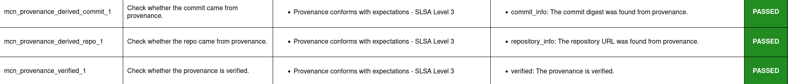

.. Copyright (c) 2024 - 2024, Oracle and/or its affiliates. All rights reserved.
.. Licensed under the Universal Permissive License v 1.0 as shown at https://oss.oracle.com/licenses/upl/.

--------------------------------------------------
Provenance discovery, extraction, and verification
--------------------------------------------------

This tutorial demonstrates how Macaron can automatically retrieve provenance for npm artifacts, validate the contents, and verify the authenticity. Any artifact that can be analyzed and checked for these properties can then be trusted to a greater degree than would be otherwise possible, as provenance files provide verifiable information, such as the commit and build service pipeline that has triggered the release.

For npm artifacts, Macaron makes use of available features provided by `npm <https://npmjs.com/>`_. Most importantly, npm allows developers to generate provenance files when publishing their artifacts. The `semver <https://www.npmjs.com/package/semver>`_ package is chosen as an example for this tutorial.

******************************
Installation and Prerequisites
******************************

Skip this section if you already know how to install Macaron.

.. toggle::

    Please follow the instructions :ref:`here <installation-guide>`. In summary, you need:

        * Docker
        * the ``run_macaron.sh``  script to run the Macaron image.

    .. note:: At the moment, Docker alternatives (e.g. podman) are not supported.

    You also need to provide Macaron with a GitHub token through the ``GITHUB_TOKEN``  environment variable.

    To obtain a GitHub Token:

    * Go to ``GitHub settings`` → ``Developer Settings`` (at the bottom of the left side pane) → ``Personal Access Tokens`` → ``Fine-grained personal access tokens`` → ``Generate new token``. Give your token a name and an expiry period.
    * Under ``"Repository access"``, choosing ``"Public Repositories (read-only)"`` should be good enough in most cases.

    Now you should be good to run Macaron. For more details, see the documentation :ref:`here <prepare-github-token>`.

********
Analysis
********

To perform an analysis on the latest version of semver (when this tutorial was written), Macaron can be run with the following command:

.. code-block:: shell

    ./run_macaron.sh analyze -purl pkg:npm/semver@7.6.2

The analysis involves Macaron downloading the contents of the target repository to the configured, or default, ``output`` folder. Results from the analysis, including checks, are stored in the database found at ``output/macaron.db``  (See :ref:`Output Files Guide <output_files_guide>`). Once the analysis is complete, Macaron will also produce a report in the form of a HTML file.

.. note:: If you are unfamiliar with PackageURLs (purl), see this link: `PURLs <https://github.com/package-url/purl-spec>`_.

During this analysis, Macaron will retrieve two provenance files from the npm registry. One is a :term:`SLSA` v1.0 provenance, while the other is a npm specific publication provenance. The SLSA provenance provides details of the artifact it relates to, the repository it was built from, and the build action used to build it. The npm specific publication provenance exists if the SLSA provenance has been verified before publication.

.. note:: Most of the details from the two provenance files can be found through the links provided on the artifacts page on the npm website. In particular: `Sigstore Rekor <https://search.sigstore.dev/?logIndex=92391688>`_. The provenance file itself can be found at: `npm registry <https://registry.npmjs.org/-/npm/v1/attestations/semver@7.6.2>`_.

Of course to reliably say the above does what is claimed here, proof is needed. For this we can rely on the check results produced from the analysis run. In particular, we want to know the results of three checks: ``mcn_provenance_derived_repo_1``, ``mcn_provenance_derived_commit_1``, and ``mcn_provenance_verified_1``. The first two to ensure that the commit and the repository being analyzed match those found in the provenance file, and the last check to ensure that the provenance file has been verified.

.. _fig_semver_7.6.2_report:

This image shows that the report produced by the previous analysis has pass results for the three checks of interest. This can also be viewed directly by opening the report file:

.. code-block:: shell

  open output/reports/npm/semver/semver.html

*****************************
Run ``verify-policy`` command
*****************************

Another feature of Macaron is policy verification. This allows Macaron to report on whether an artifact meets the security requirements specified by the user. Policies are written using `Soufflé Datalog <https://souffle-lang.github.io/index.html>`_ , a language similar to SQL. Results collected by the ``analyze`` command can be checked via declarative queries in the created policy, which Macaron can then automatically check.

For this tutorial, we can create a policy that checks whether the three checks (as above) have passed. In this way we can be sure that the requirement is satisfied without having to dive into the reports directly.

.. code-block:: prolog

    #include "prelude.dl"

    Policy("has-verified-provenance", component_id, "Require a verified provenance file.") :-
        check_passed(component_id, "mcn_provenance_derived_repo_1"),
        check_passed(component_id, "mcn_provenance_derived_commit_1"),
        check_passed(component_id, "mcn_provenance_verified_1").

    apply_policy_to("has-verified-provenance", component_id) :-
        is_component(component_id, "pkg:npm/semver@7.6.2").

After including some helper rules, the above policy is defined as requiring all three of the checks to pass through the ``check_passed(<target>, <check_name>)`` mechanism. The target is then defined by the criteria applied to the policy. In this case, the artifact with a PURL that matches the version of ``semver`` used in this tutorial: ``pkg:npm/semver@7.6.2``. With this check saved to a file, say ``verified.dl``, we can run it against Macaron's local database to confirm that the analysis we performed earlier in this tutorial did indeed pass all three checks.

.. code-block:: shell

    ./run_macaron.sh verify-policy -d output/macaron.db -f verified.dl

The result of this command should show that the policy we have written succeeds on the ``semver`` library. As follows:

.. code-block:: javascript

    component_satisfies_policy
        ['1', 'pkg:npm/semver@7.6.2', 'has-verified-provenance']
    component_violates_policy
    failed_policies
    passed_policies
        ['has-verified-provenance']

Additionally, if we had happened to run some more analyses on other versions of ``semver``, we could also apply the policy to them with only a small modification:

.. code-block:: prolog

    apply_policy_to("has-verified-provenance", component_id) :-
        is_component(component_id, purl),
        match("pkg:npm/semver@.*", purl).

With this modification, all versions of ``semver`` previously analysed will show up when the policy is run again. Like so:

.. code-block:: javascript

    component_satisfies_policy
        ['1', 'pkg:npm/semver@7.6.2', 'has-verified-provenance']
        ['2', 'pkg:npm/semver@7.6.0', 'has-verified-provenance']
    component_violates_policy
        ['3', 'pkg:npm/semver@1.0.0', 'has-verified-provenance']
    failed_policies
        ['has-verified-provenance']

Here we can see that the newer versions, 7.6.2 and 7.6.0, passed the checks, meaning they have verified provenance. The much older version, 1.0.0, did not pass the checks, which is not surprising given that it was published 13 years before this tutorial was made.

However, if we wanted to acknowledge that earlier versions of the artifact do not have provenance, and accept that as part of the policy, we can do that too. For this to succeed we need to extend the policy with more complicated modifications.

.. code-block:: prolog

    #include "prelude.dl"

    Policy("has-verified-provenance-or-is-excluded", component_id, "Require a verified provenance file.") :-
        check_passed(component_id, "mcn_provenance_derived_repo_1"),
        check_passed(component_id, "mcn_provenance_derived_commit_1"),
        check_passed(component_id, "mcn_provenance_verified_1"),
        !exception(component_id).

    Policy("has-verified-provenance-or-is-excluded", component_id, "Make exception for older artifacts.") :-
        exception(component_id).

    .decl exception(component_id: number)
    exception(component_id) :-
        is_component(component_id, purl),
        match("pkg:npm/semver@[0-6][.].*", purl).

    apply_policy_to("has-verified-provenance-or-is-excluded", component_id) :-
        is_component(component_id, purl),
        match("pkg:npm/semver@.*", purl).

In this final policy, we declare (``.decl``) a new rule called ``exception`` that utilises more regular expression in its ``match`` constraint to exclude artifacts that were published before provenance generation was supported. For this tutorial, we have set the exception to accept any versions of ``semver`` that starts with a number between 0 and 6 using the regular expression range component of ``[0-6]``. Then we modify the previous ``Policy`` so that it expects the same three checks to pass, but only if the exception rule is not applicable -- the exclamation mark before the exception negates the requirement. Finally, we add a new ``Policy`` that applies only to those artifacts that match the exception rule.

When run, this updated policy produces the following:

.. code-block:: javascript

    component_satisfies_policy
        ['1', 'pkg:npm/semver@7.6.2', 'has-verified-provenance-or-is-excluded']
        ['2', 'pkg:npm/semver@7.6.0', 'has-verified-provenance-or-is-excluded']
        ['3', 'pkg:npm/semver@1.0.0', 'has-verified-provenance-or-is-excluded']
    component_violates_policy
    failed_policies
    passed_policies
        ['has-verified-provenance-or-is-excluded']

Now all versions pass the policy check.
