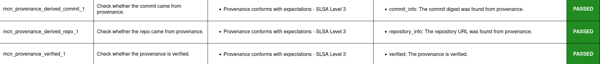
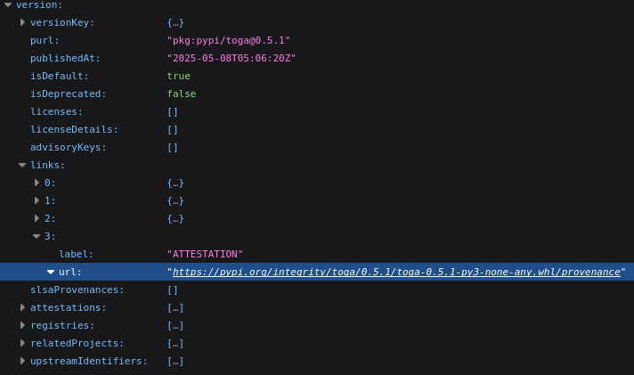
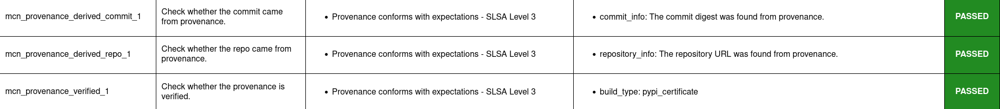
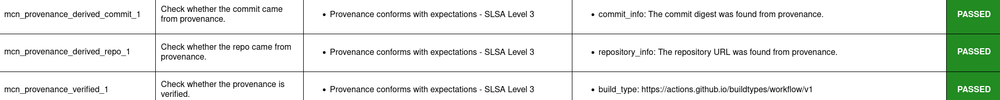
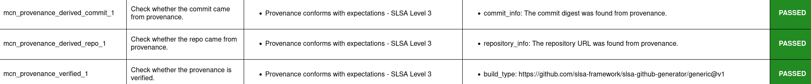

.. Copyright (c) 2024 - 2024, Oracle and/or its affiliates. All rights reserved.
.. Licensed under the Universal Permissive License v 1.0 as shown at https://oss.oracle.com/licenses/upl/.

--------------------------------------------------
Provenance discovery, extraction, and verification
--------------------------------------------------

This tutorial demonstrates how Macaron can automatically retrieve provenance for artifacts, validate the contents, and verify the authenticity. Any artifact that can be analyzed and checked for these properties can then be trusted to a greater degree than would be otherwise possible, as provenance files provide verifiable information, such as the commit and build service pipeline that has triggered the release.

Currently, Macaron supports discovery of attestation for:

    * npm artifacts using features provided by `npm <https://npmjs.com/>`_
    * PyPI artifacts using features provided by `Open Source Insights <https://deps.dev/>`_
    * Artifacts that have published attestations to, or released as assets to `GitHub <https://docs.github.com/en/rest/repos/repos?apiVersion=2022-11-28#list-attestations>`_

This tutorial uses example packages to demonstrate these discovery methods: The `semver <https://www.npmjs.com/package/semver>`_ npm package, the `toga <https://pypi.org/pypi/toga>`_ PyPI package, and the `urllib3 <https://pypi.org/project/urllib3>`_ PyPI package.

.. note:: Macaron has a size limit imposed for downloads. For more information on this see Section :ref:`Download Limit`.

.. contents:: :local:

******************************
Installation and Prerequisites
******************************

Skip this section if you already know how to install Macaron.

.. toggle::

    Please follow the instructions :ref:`here <installation-guide>`. In summary, you need:

        * Docker
        * the ``run_macaron.sh``  script to run the Macaron image.

    .. note:: At the moment, Docker alternatives (e.g. podman) are not supported.

    You also need to provide Macaron with a GitHub token through the ``GITHUB_TOKEN``  environment variable.

    To obtain a GitHub Token:

    * Go to ``GitHub settings`` → ``Developer Settings`` (at the bottom of the left side pane) → ``Personal Access Tokens`` → ``Fine-grained personal access tokens`` → ``Generate new token``. Give your token a name and an expiry period.
    * Under ``"Repository access"``, choosing ``"Public Repositories (read-only)"`` should be good enough in most cases.

    Now you should be good to run Macaron. For more details, see the documentation :ref:`here <prepare-github-token>`.

The analyses in this tutorial involve downloading the contents of a target repository to the configured, or default, ``output`` folder. Results from the analyses, including checks, are stored in the database found at ``output/macaron.db``  (See :ref:`Output Files Guide <output_files_guide>`). Once the analysis is complete, Macaron will also produce a report in the form of a HTML file.

.. note:: If you are unfamiliar with PackageURLs (purl), see this link: `PURLs <https://github.com/package-url/purl-spec>`_.

**************************************
Attestation Discovery for semver (npm)
**************************************

To analyze a specific version of the semver package, Macaron can be run with the following command:

.. code-block:: shell

    ./run_macaron.sh analyze -purl pkg:npm/semver@7.7.2

During this analysis, Macaron will retrieve two provenance files from the npm registry. One is a :term:`SLSA` v1.0 provenance, while the other is a npm specific publication provenance. The SLSA provenance provides details of the artifact it relates to, the repository it was built from, and the build action used to build it. The npm specific publication provenance exists if the SLSA provenance has been verified before publication.

.. note:: Most of the details from the two provenance files can be found through the links provided on the artifacts page on the npm website. In particular: `Sigstore Rekor <https://search.sigstore.dev/?logIndex=211457167>`_. The provenance file itself can be found at: `npm registry <https://registry.npmjs.org/-/npm/v1/attestations/semver@7.7.2>`_.

Of course to reliably say the above does what is claimed here, proof is needed. For this we can rely on the check results produced from the analysis run. In particular, we want to know the results of three checks: ``mcn_provenance_derived_repo_1``, ``mcn_provenance_derived_commit_1``, and ``mcn_provenance_verified_1``. The first two to ensure that the commit and the repository being analyzed match those found in the provenance file, and the last check to ensure that the provenance file has been verified.

.. _fig_semver_7.7.2_report:

This image shows that the report produced by the previous analysis has pass results for the three checks of interest. This can also be viewed directly by opening the report file:

.. code-block:: shell

  open output/reports/npm/semver/semver.html

The check results of this example (and others) can be automatically verified. A demonstration of verification for this case is provided later in this tutorial.

*************************************
Attestation Discovery for toga (PyPI)
*************************************

To analyze a specific version of the toga package, Macaron can be run with the following command:

.. code-block:: shell

    ./run_macaron.sh analyze -purl pkg:pypi/toga@0.5.1

During this analysis, Macaron will retrieve information from two sources to attempt to discover a PyPI attestation file. Firstly, Open Source Insights will be queried for an attestation URL that can be used to access the desired information. If found, this URL can be followed to its source on the PyPI package registry, which is where the actual attestation file is hosted.

As an example of these internal steps, the attestation information can be seen via the `Open Source Insights API <https://api.deps.dev/v3alpha/purl/pkg:pypi%2Ftoga@0.5.1>`_. From this information the PyPI attestation URL is extracted, revealing its location: `https://pypi.org/integrity/toga/0.5.1/toga-0.5.1-py3-none-any.whl/provenance <https://pypi.org/integrity/toga/0.5.1/toga-0.5.1-py3-none-any.whl/provenance>`_.

.. _fig_toga_osi_api:

This image shows the attestation URL found in the Open Source Insight API result.

By using the Open Source Insights API, Macaron can check that the discovered provenance is verified, as well as being a valid match of the user provided PURL. For this we can rely on the check results produced from the analysis run. In particular, we want to know the results of three checks: ``mcn_provenance_derived_repo_1``, ``mcn_provenance_derived_commit_1``, and ``mcn_provenance_verified_1``. The first two to ensure that the commit and the repository being analyzed match those found in the provenance file, and the last check to ensure that the provenance file has been verified.

.. _fig_toga_pypi_checks:

All three checks show they have passed, meaning Macaron has discovered the correct provenance for the user provided PURL, and determined that it is verified. To access the full report use the following:

.. code-block:: shell

  open output/reports/pypi/toga/toga.html

***************************************
Attestation Discovery for toga (GitHub)
***************************************

The toga library is interesting in that it has GitHub attestation or PyPI attestation depending on which particular version of it is analyzed. To discover a GitHub attestation, we can analyze version 0.4.8:

.. code-block:: shell

    ./run_macaron.sh analyze -purl pkg:pypi/toga@0.4.8

During this analysis, Macaron will attempt to discover a GitHub attestation by computing the hash of the relevant artifact. This is a requirement of GitHub's API to view artifact attestation, see the `GitHub Attestation API <https://docs.github.com/en/rest/repos/repos?apiVersion=2022-11-28#list-attestations>`_. The hash is computed by downloading the artifact and analysing it with the SHA256 algorithm. With the hash, the GitHub API can be called to find the related attestation.

In this particular case, the SHA256 hash of the toga 0.4.8 artifact is 0814a72abb0a9a5f22c32cc9479c55041ec30cdf4b12d73a0017aee58f9a1f00. A GitHub attestation can be found for this artifact `here <https://api.github.com/repos/beeware/toga/attestations/sha256:0814a72abb0a9a5f22c32cc9479c55041ec30cdf4b12d73a0017aee58f9a1f00>`_.

Attestation discovered through GitHub is signed with verified signatures. As long as the repository URL and commit digest associated with the user provided PURL match what is found within the attestation, Macaron can report it as verified. Therefore, we can examine the results of three checks: ``mcn_provenance_derived_repo_1``, ``mcn_provenance_derived_commit_1``, and ``mcn_provenance_verified_1``.

.. _fig_toga_github_checks:

This image shows that all three checks have passed, confirming that the repository URL and commit digest from the provenance match those associated with the user provided PURL. To access the full report use the following command:

.. code-block:: shell

  open output/reports/pypi/toga/toga.html

.. note:: For Maven packages, Macaron can make use of the local artifact cache before downloading occurs. Macaron will check for the existence of the home M2 cache at ``$HOME/.m2``. A different location for this cache can be specified using Macaron's ``--local-maven-repo <path_to_m2_cache>`` command line argument.

******************************************
Attestation discovery for urllib3 (GitHub)
******************************************

To demonstrate GitHub attestation being found from released assets on the platform, we use the urllib3 library.

.. code-block:: shell

    ./run_macaron.sh analyze -purl pkg:pypi/urllib3@2.0.0a1

As part of this analysis, Macaron ends up downloading three different asset files: The `attestation asset <https://api.github.com/repos/urllib3/urllib3/releases/assets/84708804>`_, the artifact's Python wheel file, and the source distribution tarball file. By examining the attestation, Macaron can verify the two other files. This analysis can then report that provenance exists, and is verified.

If we look at the results of three of Macaron's checks we can validate this result: ``mcn_provenance_derived_repo_1``, ``mcn_provenance_derived_commit_1``, and ``mcn_provenance_verified_1``.

.. _fig_urllib3_github_checks:

This image shows that all three checks have passed, confirming that the repository URL and commit digest from the provenance match those associated with the user provided PURL, and that the provenance is verified. To access the full report use the following:

.. code-block:: shell

  open output/reports/pypi/urllib3/urllib3.html

***************************
Supported Attestation Types
***************************

When attestation is provided to Macaron as input, it must be of one of the supported types in order to be accepted. Support is defined by the ``predicateType`` and ``buildType`` properties within an attestation.

Predicate Types
~~~~~~~~~~~~~~~

    * SLSA v0.1
    * SLSA v0.2
    * SLSA v1.0
    * Witness v0.1

Build Types
~~~~~~~~~~~

.. csv-table::
    :header: "Name", "Build Type"

    "SLSA GitHub Generic              v0.1", "https://github.com/slsa-framework/slsa-github-generator/generic@v1"
    "SLSA GitHub Actions              v1.0", "https://slsa-framework.github.io/github-actions-buildtypes/workflow/v1"
    "SLSA npm CLI                     v2.0", "https://github.com/npm/cli/gha/v2"
    "SLSA Google Cloud Build          v1.0", "https://slsa-framework.github.io/gcb-buildtypes/triggered-build/v1"
    "SLSA Oracle Cloud Infrastructure v1.0", "https://github.com/oracle/macaron/tree/main/src/macaron/resources/provenance-buildtypes/oci/v1"
    "Witness GitLab                   v0.1", "https://witness.testifysec.com/attestation-collection/v0.1"

.. _Download Limit:

*******************
File Download Limit
*******************

To prevent analyses from taking too long, Macaron imposes a configurable size limit for downloads. This includes files being downloaded for provenance verification. In cases where the limit is being reached and you wish to continue analysis regardless, you can specify a new download size in the default configuration file. This value can be found under the ``slsa.verifier`` section, listed as ``max_download_size`` with a default limit of 10 megabytes. See :ref:`How to change the default configuration <change-config>` for more details on configuring values like these.

**************************************
Run ``verify-policy`` command (semver)
**************************************

Another feature of Macaron is policy verification, which allows it to assess whether an artifact meets user-defined security requirements. This feature can also be integrated into CI/CD pipelines to automatically check policy compliance by returning appropriate error codes based on pass or fail status. Policies are written using `Soufflé Datalog <https://souffle-lang.github.io/index.html>`_ , a language similar to SQL. Results collected by the ``analyze`` command can be checked via declarative queries in the created policy, which Macaron can then automatically check.

For this tutorial, we can create a policy that checks whether the three checks relating to the semver npm example above have passed. E.g. ``mcn_provenance_derived_repo_1``, ``mcn_provenance_derived_commit_1``, and ``mcn_provenance_verified_1``. In this way we can be sure that the requirement is satisfied without having to dive into the reports directly.

.. code-block:: prolog

    #include "prelude.dl"

    Policy("has-verified-provenance", component_id, "Require a verified provenance file.") :-
        check_passed(component_id, "mcn_provenance_derived_repo_1"),
        check_passed(component_id, "mcn_provenance_derived_commit_1"),
        check_passed(component_id, "mcn_provenance_verified_1").

    apply_policy_to("has-verified-provenance", component_id) :-
        is_component(component_id, "pkg:npm/semver@7.7.2").

After including some helper rules, the above policy is defined as requiring all three of the checks to pass through the ``check_passed(<target>, <check_name>)`` mechanism. The target is then defined by the criteria applied to the policy. In this case, the artifact with a PURL that matches the version of ``semver`` used in this tutorial: ``pkg:npm/semver@7.7.2``. With this check saved to a file, say ``verified.dl``, we can run it against Macaron's local database to confirm that the analysis we performed earlier in this tutorial did indeed pass all three checks.

.. code-block:: shell

    ./run_macaron.sh verify-policy -d output/macaron.db -f verified.dl

The result of this command should show that the policy we have written succeeds on the ``semver`` library. As follows:

.. code-block:: javascript

    component_satisfies_policy
        ['1', 'pkg:npm/semver@7.7.2', 'has-verified-provenance']
    component_violates_policy
    failed_policies
    passed_policies
        ['has-verified-provenance']

Additionally, if we had happened to run some more analyses on other versions of ``semver``, we could also apply the policy to them with only a small modification:

.. code-block:: prolog

    apply_policy_to("has-verified-provenance", component_id) :-
        is_component(component_id, purl),
        match("pkg:npm/semver@.*", purl).

With this modification, all versions of ``semver`` previously analysed will show up when the policy is run again. Like so:

.. code-block:: javascript

    component_satisfies_policy
        ['1', 'pkg:npm/semver@7.7.2', 'has-verified-provenance']
        ['2', 'pkg:npm/semver@7.6.0', 'has-verified-provenance']
    component_violates_policy
        ['3', 'pkg:npm/semver@1.0.0', 'has-verified-provenance']
    failed_policies
        ['has-verified-provenance']

Here we can see that the newer versions, 7.7.2 and 7.6.0, passed the checks, meaning they have verified provenance. The much older version, 1.0.0, did not pass the checks, which is not surprising given that it was published 13 years before this tutorial was made.

However, if we wanted to acknowledge that earlier versions of the artifact do not have provenance, and accept that as part of the policy, we can do that too. For this to succeed we need to extend the policy with more complicated modifications.

.. code-block:: prolog

    #include "prelude.dl"

    Policy("has-verified-provenance-or-is-excluded", component_id, "Require a verified provenance file.") :-
        check_passed(component_id, "mcn_provenance_derived_repo_1"),
        check_passed(component_id, "mcn_provenance_derived_commit_1"),
        check_passed(component_id, "mcn_provenance_verified_1"),
        !exception(component_id).

    Policy("has-verified-provenance-or-is-excluded", component_id, "Make exception for older artifacts.") :-
        exception(component_id).

    .decl exception(component_id: number)
    exception(component_id) :-
        is_component(component_id, purl),
        match("pkg:npm/semver@[0-6][.].*", purl).

    apply_policy_to("has-verified-provenance-or-is-excluded", component_id) :-
        is_component(component_id, purl),
        match("pkg:npm/semver@.*", purl).

In this final policy, we declare (``.decl``) a new rule called ``exception`` that utilises more regular expression in its ``match`` constraint to exclude artifacts that were published before provenance generation was supported. For this tutorial, we have set the exception to accept any versions of ``semver`` that starts with a number between 0 and 6 using the regular expression range component of ``[0-6]``. Then we modify the previous ``Policy`` so that it expects the same three checks to pass, but only if the exception rule is not applicable -- the exclamation mark before the exception negates the requirement. Finally, we add a new ``Policy`` that applies only to those artifacts that match the exception rule.

When run, this updated policy produces the following:

.. code-block:: javascript

    component_satisfies_policy
        ['1', 'pkg:npm/semver@7.7.2', 'has-verified-provenance-or-is-excluded']
        ['2', 'pkg:npm/semver@7.6.0', 'has-verified-provenance-or-is-excluded']
        ['3', 'pkg:npm/semver@1.0.0', 'has-verified-provenance-or-is-excluded']
    component_violates_policy
    failed_policies
    passed_policies
        ['has-verified-provenance-or-is-excluded']

Now all versions pass the policy check.
